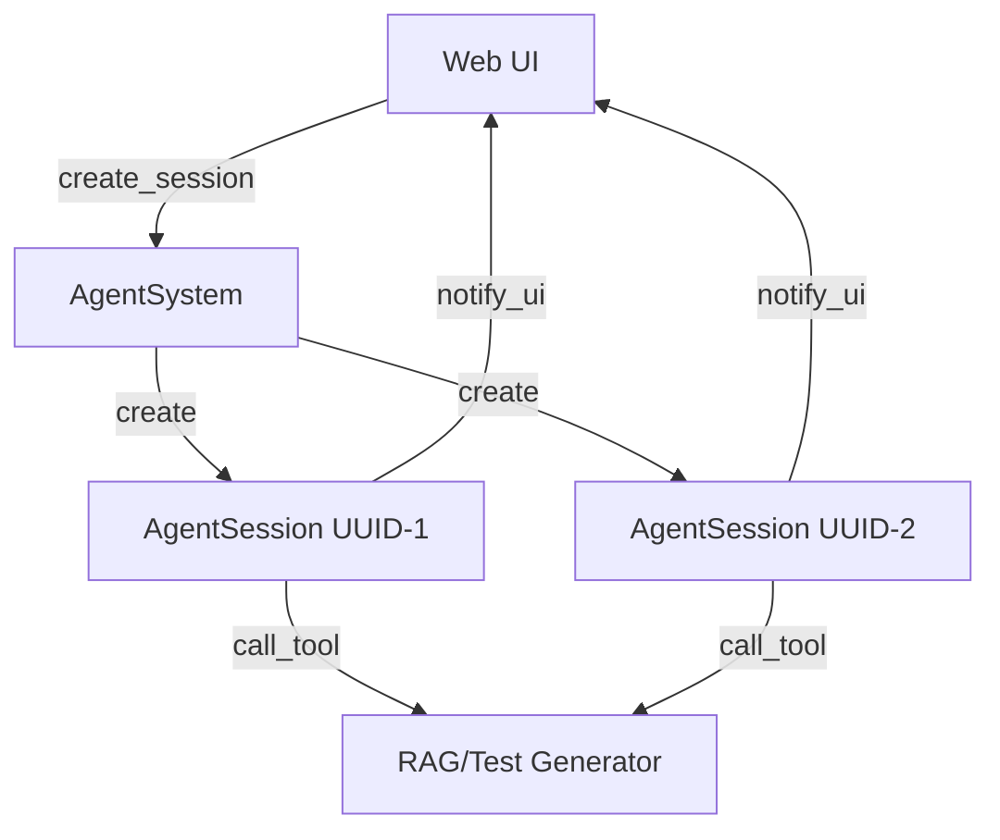
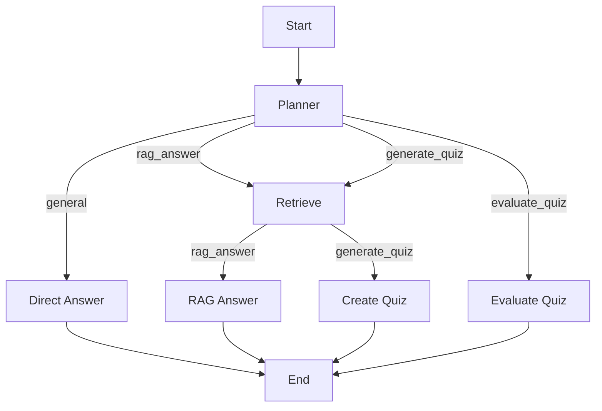

# Документация по агенту

## Обзор

Агент — это система на основе LangGraph, которая поддерживает сложные сценарии взаимодействия, включая простые разговоры, работу с RAG (Retrieval-Augmented Generation) и генерацию/оценку квизов.

Начиная с версии 2.0, агент поддерживает **множественные сессии** с автоматическим управлением состоянием, ограничением параллелизма и реальными уведомлениями в Web UI.

## Архитектура

### Система сессий

Агент использует `AgentSession` для управления каждой отдельной сессией:



### Ключевые компоненты

#### 1. **AgentSession**
Отвечает за управление одной сессией:
- Состояние: `state`, `task`, `last_active_at`, `created_at`, `last_events`
- Управление жизненным циклом: `start()`, `cancel()`, `cleanup()`
- Уведомления UI: `notify_ui()` с fire-and-forget (timeout 5 сек)
- Вызов инструментов: `call_tool()` с прогресс-уведомлениями

**Источник:** `agent_service/agent_session.py`

#### 2. **AgentSystem**
Централизованный менеджер сессий:
- Sessions map: `sessions: Dict[str, AgentSession]`
- Ограничение параллелизма: `session_semaphore: Semaphore`
- Методы: `create_session()`, `get_session()`, `remove_session()`, `sweep_expired_sessions()`, `run()`

**Источник:** `agent_service/agent_system.py`

### Граф состояний



**Узлы:**
- **Planner**: Определяет намерение пользователя
- **Retrieve**: Выполняет поиск через RAG
- **Direct Answer**: Отвечает на общие вопросы
- **RAG Answer**: Генерирует ответ по документам
- **Create Quiz**: Создает квиз
- **Evaluate Quiz**: Оценивает ответы

## Управление сессиями

### Создание и запуск

```python
from agent_system import AgentSystem

agent = AgentSystem()

# Создание сессии
session_id = agent.create_session()

# Запуск задачи
result = await agent.run(
    question="Создай квиз по машинному обучению",
    session_id=session_id
)
```

### Уведомления в Web UI

Система автоматически отправляет уведомления на URL из конфига:

**Типы уведомлений:**
- `start` — начало выполнения
- `progress` — промежуточный результат
- `done` — завершение успешно
- `error` — ошибка выполнения
- `cancelled` — отмена пользователем

**Формат:**
```json
{
  "session_id": "uuid-1",
  "step": "rag_search",
  "message": "Поиск документов...",
  "tool": "rag_search",
  "level": "info",
  "meta": {"query": "машинное обучение"},
  "timestamp": "2025-12-25T13:00:00Z"
}
```

### Управление ресурсами

#### Очистка протухших сессий

```python
# Автоматическая очистка (внутри run())
agent.sweep_expired_sessions()

# Ручная очистка
agent.sweep_expired_sessions(force=True)
```

**Параметры:**
- `session_ttl_seconds`: 600 (10 минут) из конфига
- Удаляет сессии без активности > 10 минут

#### Ограничение параллелизма

Максимум 3 сессии одновременно (из конфига). При превышении создание блокируется.

## Конфигурация

### Настройки

**Источник:** `agent_service/settings.py`

```python
web_ui_url: str = "http://localhost:8150"
session_ttl_seconds: int = 600
concurrency_limit: int = 3
```

### Конфигурационные файлы

**Источники:**
- `agent_service/app_settings-dev.json`
- `agent_service/app_settings-prod.json`

```json
{
  "web_ui_url": "http://localhost:8150",
  "session_ttl_seconds": 600,
  "concurrency_limit": 3
}
```

## Примеры использования

### Простой разговор

```python
agent = AgentSystem()
result = await agent.run("Привет! Как дела?", session_id="chitchat_session")
```

### Работа с RAG

```python
agent = AgentSystem()
result = await agent.run(
    "Расскажи о машинном обучении из учебника Яндекса",
    session_id="rag_session"
)
```

### Генерация и оценка квиза

```python
agent = AgentSystem()

# Генерируем квиз
quiz_result = await agent.run(
    "Создай квиз по машинному обучению",
    session_id="quiz_session"
)

# Оцениваем ответы (контекст сохраняется)
evaluation_result = await agent.run(
    "Вот мои ответы: ответ 1, ответ 2",
    session_id="quiz_session"
)
```

### Множественные сессии

```python
agent = AgentSystem()

# Сессия 1: Генерация квиза
session1 = agent.create_session()
await agent.run("Создай квиз по Python", session_id=session1)

# Сессия 2: RAG-ответ (параллельно)
session2 = agent.create_session()
await agent.run("Объясни ML", session_id=session2)
```

### Управление сессиями

```python
agent = AgentSystem()

# Создать сессию
session_id = agent.create_session()

# Проверить статус
session = agent.get_session(session_id)
if session:
    print(f"Активна: {session.is_running()}")
    print(f"Возраст: {session.get_age_seconds()} сек")

# Отменить выполнение
await agent.get_session(session_id).cancel()

# Удалить сессию
agent.remove_session(session_id)
```

## Безопасность и ограничения

### Ограничение параллелизма
- Максимум 3 сессии одновременно
- Используется `asyncio.Semaphore`

### Таймауты
- **UI уведомления**: 5 секунд на HTTP запрос
- **Сессия**: 10 минут без активности (TTL)
- **Инструменты**: Без таймаута (зависит от внешних сервисов)

### Потокобезопасность
- `asyncio.Lock` для защиты состояния сессии
- `asyncio.Semaphore` для ограничения параллелизма
- `deque(maxlen=200)` для истории событий

## Логирование

Все компоненты логируют действия:

```bash
2025-12-25 13:00:00 | INFO | agent_system | Инициализация агента: provider=openai
2025-12-25 13:00:01 | INFO | agent_session | AgentSession created: uuid-1
2025-12-25 13:00:02 | INFO | agent_session | Start processing: uuid-1
2025-12-25 13:00:03 | INFO | agent_session | Tool call: rag_search
2025-12-25 13:00:05 | INFO | agent_session | UI notification sent: uuid-1
2025-12-25 13:00:10 | INFO | agent_session | Task completed: uuid-1
```

## Тестирование

### Unit тесты

```bash
docker run --rm -v $(pwd):/app -w /app agent_service_test uv run pytest tests/ -v
# Результат: 33/33 тестов ✅
```

**Покрытие:**
- `test_agent_session.py`: 18 тестов
- `test_agent_system_sessions.py`: 15 тестов

**Источники тестов:**
- `agent_service/tests/test_agent_session.py`
- `agent_service/tests/test_agent_system_sessions.py`

### Интеграционные тесты

См. `agent_service/tests/addititional/` и `agent_service/tests/components/` для тестов с внешними сервисами.

## Производительность

- **Создание сессии**: < 1 мс
- **Запуск задачи**: ~2-5 сек (зависит от RAG/генерации)
- **Уведомление UI**: < 5 сек (с таймаутом)
- **Очистка сессий**: < 100 мс (100 сессий)

## Миграция с v1.x

### Старый API (v1.x)
```python
agent = AgentSystem()
result = agent.run("question", session_id="session")
```

### Новый API (v2.x)
```python
agent = AgentSystem()
result = await agent.run("question", session_id="session")
```

**Изменения:**
- ✅ Автоматическое создание сессий
- ✅ Реальные уведомления в Web UI
- ✅ Ограничение параллелизма
- ✅ Автоматическая очистка
- ✅ Подробная история событий

## Заключение

Система сессий агента обеспечивает:

- **Масштабируемость**: Множество параллельных сессий
- **Надежность**: Автоматическое управление ресурсами
- **Прозрачность**: Реальные уведомления о прогрессе
- **Безопасность**: Ограничение параллелизма и таймауты
- **Гибкость**: Конфигурируемые параметры

Для более подробной информации о тестировании агента, см. [Документация по тестам](test_documentation.md).