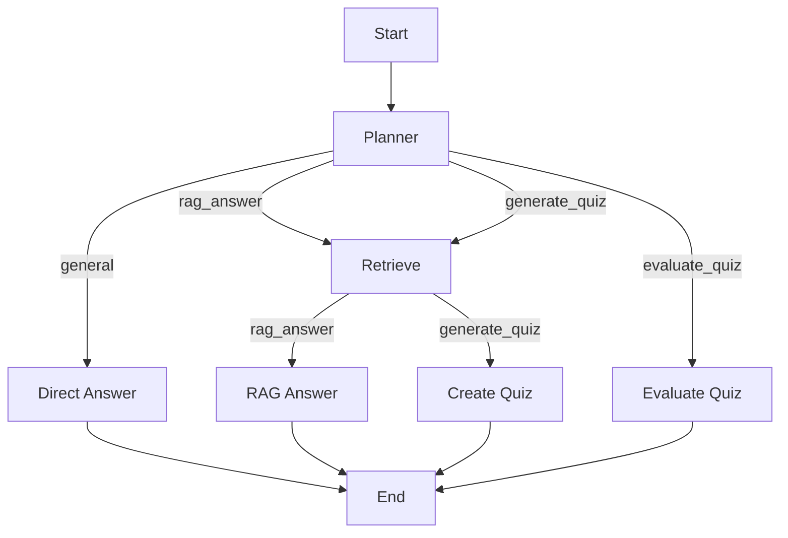

# Документация по агенту

## Обзор

Агент — это система на основе LangGraph, которая поддерживает сложные сценарии взаимодействия, включая простые разговоры, работу с RAG (Retrieval-Augmented Generation) и генерацию/оценку квизов. Агент использует память для сохранения состояния между вызовами, что позволяет реализовывать сложные сценарии, такие как генерация квиза и последующая оценка ответов пользователя.

## Архитектура

### Состояние агента

Агент использует `AgentState` для хранения промежуточных данных и результатов. Состояние включает следующие поля:

- `question`: Вопрос пользователя.
- `intent`: Намерение пользователя (general, rag_answer, generate_quiz, evaluate_quiz).
- `documents`: Список документов, найденных в RAG.
- `quiz_content`: Сгенерированный квиз.
- `user_solution`: Ответы пользователя на квиз.
- `final_answer`: Итоговый ответ агента.

### Граф состояний

Граф агента состоит из нескольких узлов, которые обрабатывают различные сценарии взаимодействия:



### Узлы графа

1. **Planner**: Определяет намерение пользователя и устанавливает `intent`.
2. **Retrieve**: Выполняет поиск документов через RAG.
3. **Direct Answer**: Отвечает на общие вопросы без использования инструментов.
4. **RAG Answer**: Генерирует ответ на основе найденных документов.
5. **Create Quiz**: Создает квиз на основе документов.
6. **Evaluate Quiz**: Оценивает ответы пользователя на квиз.

### Маршрутизация

Агент использует условные ребра для маршрутизации между узлами на основе `intent`:

- `route_after_planner`: Определяет следующий узел после планирования.
- `route_after_retriever`: Определяет следующий узел после поиска документов.

### Память

Агент использует `MemorySaver` для сохранения состояния между вызовами. Это позволяет реализовывать сложные сценарии, такие как генерация квиза и последующая оценка ответов пользователя. Память сохраняется по `session_id`, что позволяет управлять несколькими сессиями одновременно.

#### Механизм памяти

Агент использует `MemorySaver` из библиотеки LangGraph для сохранения состояния между вызовами. Это позволяет:

1. **Сохранять состояние сессии**: Состояние агента, включая промежуточные результаты и намерения, сохраняется между вызовами.
2. **Управлять несколькими сессиями**: Каждая сессия имеет уникальный `session_id`, что позволяет управлять несколькими сессиями одновременно.
3. **Восстанавливать состояние**: При каждом вызове агента состояние сессии восстанавливается, что позволяет продолжать работу с предыдущего состояния.

#### Пример использования памяти

```python
agent = AgentSystem()
# Генерируем квиз
quiz_result = agent.run("Создай квиз по машинному обучению из учебника Яндекса", session_id="quiz_session")
print(quiz_result)

# Оцениваем ответы
evaluation_result = agent.run("Вот мои ответы на квиз: ответ 1, ответ 2", session_id="quiz_session")
print(evaluation_result)
```

В этом примере состояние сессии `quiz_session` сохраняется между вызовами, что позволяет агенту помнить сгенерированный квиз и оценивать ответы пользователя.

#### Управление памятью

Агент автоматически управляет памятью, сохраняя и восстанавливая состояние сессии при каждом вызове. Это позволяет сосредоточиться на логике работы агента, не заботясь о сохранении состояния.

## Примеры использования

### Простой разговор

```python
agent = AgentSystem()
result = agent.run("Привет! Как дела?", session_id="chitchat_session")
print(result)
```

### Работа с RAG

```python
agent = AgentSystem()
result = agent.run("Расскажи о машинном обучении из учебника Яндекса", session_id="rag_session")
print(result)
```

### Генерация и оценка квиза

```python
agent = AgentSystem()
# Генерируем квиз
quiz_result = agent.run("Создай квиз по машинному обучению из учебника Яндекса", session_id="quiz_session")
print(quiz_result)

# Оцениваем ответы
 evaluation_result = agent.run("Вот мои ответы на квиз: ответ 1, ответ 2", session_id="quiz_session")
print(evaluation_result)
```

## Логирование

Все инструменты и узлы агента логируют свои вызовы и результаты. Это позволяет отслеживать работу агента и диагностировать проблемы.

## Заключение

Агент поддерживает сложные сценарии взаимодействия, включая простые разговоры, работу с RAG и генерацию/оценку квизов. Использование памяти позволяет реализовывать сложные сценарии, такие как генерация квиза и последующая оценка ответов пользователя.

Для более подробной информации о тестировании агента, см. [Документация по тестам](test_documentation.md).