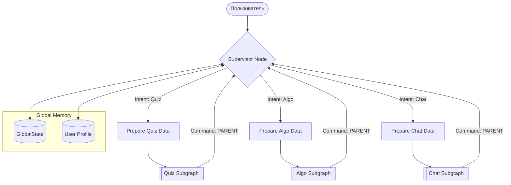
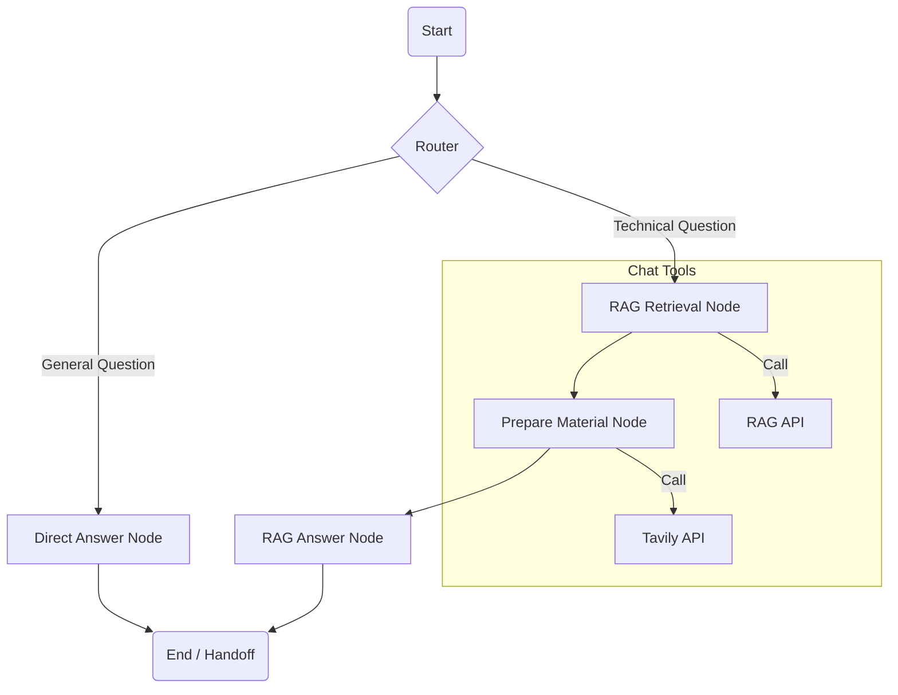
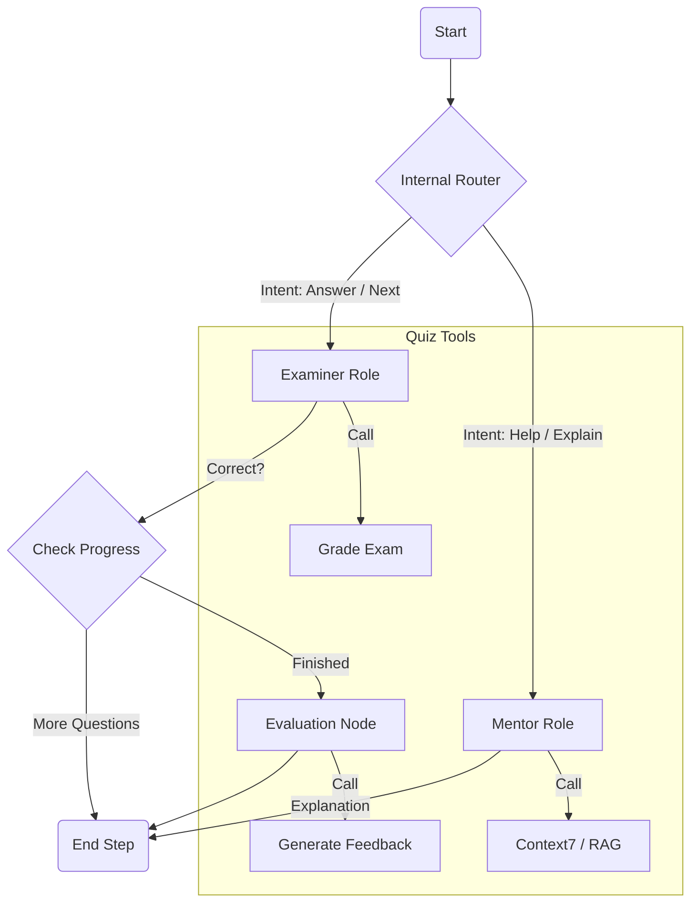
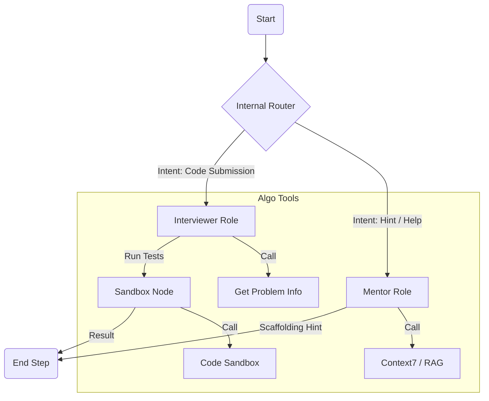

# Документация по агенту NetRunner (Архитектура 2026)

## 1. Введение

NetRunner — это продвинутый образовательный AI-агент, построенный на базе фреймворка **LangGraph** с использованием паттерна **"Router-driven Subgraphs"**. Эта архитектура обеспечивает модульность, изоляцию контекста и возможность динамического переключения ролей.

## 2. Архитектура системы

Система реализована как иерархический граф, где главный оркестратор управляет специализированными подграфами.

### 2.1 Supervisor Graph (Оркестратор)

Главный граф отвечает за маршрутизацию и управление глобальной памятью.

```mermaid
graph TD
    User([Пользователь]) --> Supervisor{Supervisor Node}
    
    subgraph "Global Memory"
        State[(GlobalState)]
        Profile[(User Profile)]
    end
    
    Supervisor <--> State
    Supervisor <--> Profile
    
    Supervisor --"Intent: Quiz"--> QuizHandoff[Prepare Quiz Data]
    Supervisor --"Intent: Algo"--> AlgoHandoff[Prepare Algo Data]
    Supervisor --"Intent: Chat"--> ChatHandoff[Prepare Chat Data]
    
    QuizHandoff --> QuizGraph[[Quiz Subgraph]]
    AlgoHandoff --> AlgoGraph[[Algo Subgraph]]
    ChatHandoff --> ChatGraph[[Chat Subgraph]]
    
    QuizGraph --"Command: PARENT"--> Supervisor
    AlgoGraph --"Command: PARENT"--> Supervisor
    ChatGraph --"Command: PARENT"--> Supervisor
```

### 2.2 Chat Subgraph (Свободный диалог)

Режим для общего общения и поиска информации.

```mermaid
graph TD
    C_Start(Start) --> C_Router{Router}
    
    C_Router --"General Question"--> C_Direct[Direct Answer Node]
    C_Router --"Technical Question"--> C_RAG[RAG Retrieval Node]
    
    C_RAG --> C_Prepare[Prepare Material Node]
    C_Prepare --> C_Generate[RAG Answer Node]
    
    C_Direct --> C_End(End / Handoff)
    C_Generate --> C_End
    
    subgraph "Chat Tools"
        C_RAG --"Call"--> Tool_RAG[RAG API]
        C_Prepare --"Call"--> Tool_Web[Tavily API]
    end
```

### 2.3 Quiz Subgraph (Тестирование)

Режим проведения квизов с разделением ролей экзаменатора и ментора.

```mermaid
graph TD
    Q_Start(Start) --> Q_Router{Internal Router}
    
    Q_Router --"Intent: Answer / Next"--> Q_Examiner[Examiner Role]
    Q_Router --"Intent: Help / Explain"--> Q_Mentor[Mentor Role]
    
    Q_Examiner --"Correct?"--> Q_Check{Check Progress}
    Q_Check --"More Questions"--> Q_End(End Step)
    Q_Check --"Finished"--> Q_Eval[Evaluation Node]
    
    Q_Mentor --"Explanation"--> Q_End
    Q_Eval --> Q_End
    
    subgraph "Quiz Tools"
        Q_Examiner --"Call"--> Tool_Grade[Grade Exam]
        Q_Eval --"Call"--> Tool_Gen[Generate Feedback]
        Q_Mentor --"Call"--> Tool_Docs[Context7 / RAG]
    end
```

### 2.4 Algo Subgraph (Алгоритмы)

Режим решения задач с использованием Code Sandbox.

```mermaid
graph TD
    A_Start(Start) --> A_Router{Internal Router}
    
    A_Router --"Intent: Code Submission"--> A_Interviewer[Interviewer Role]
    A_Router --"Intent: Hint / Help"--> A_Mentor[Mentor Role]
    
    A_Interviewer --"Run Tests"--> A_Sandbox[Sandbox Node]
    A_Sandbox --"Result"--> A_End(End Step)
    
    A_Mentor --"Scaffolding Hint"--> A_End
    
    subgraph "Algo Tools"
        A_Interviewer --"Call"--> Tool_Problem[Get Problem Info]
        A_Sandbox --"Call"--> Tool_Exec[Code Sandbox]
        A_Mentor --"Call"--> Tool_Docs[Context7 / RAG]
    end
```

## 3. Управление состоянием (Scoped State)

Мы используем стратегию **Scoped State** для изоляции контекста.

*   **GlobalState**: Хранит `messages` (полная история), `user_profile` (компетенции), `active_mode`.
*   **SubgraphState**: Хранит только локальные данные (например, `current_question_index` для квиза).

**Маппинг (Handoff):**
При переходе в подграф `Supervisor` передает только необходимые данные. При выходе подграф возвращает результаты через `Command(graph=Command.PARENT)`, которые обновляют глобальный профиль пользователя.

## 4. Ролевая модель

Агент динамически меняет Persona:
1.  **Core Identity**: Базовый эксперт (всегда в `SystemMessage`).
2.  **Task Identity**: Специализация (Examiner, Mentor, Interviewer) в зависимости от узла.

## 5. Персистентность

Благодаря механизму **Checkpointing** в LangGraph, состояние каждого подграфа сохраняется. Пользователь может прервать сессию и продолжить с того же места, используя тот же `thread_id`.