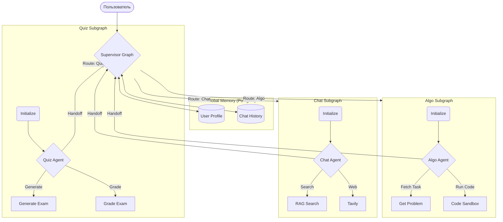

# Документация по агенту NetRunner (Архитектура 2026)

## 1. Введение

NetRunner — это продвинутый образовательный AI-агент, построенный на базе фреймворка **LangGraph** с использованием паттерна **"Router-driven Subgraphs"**. Эта архитектура обеспечивает модульность, изоляцию контекста и возможность динамического переключения ролей.

## 2. Архитектура Supervisor + Subgraphs

Система состоит из главного графа-оркестратора (`Supervisor`) и специализированных подграфов (`Subgraphs`), каждый из которых инкапсулирует логику конкретного режима работы.

### 2.1 Диаграмма архитектуры


```mermaid
graph TD
    User([Пользователь]) --> Supervisor{Supervisor Graph}
    
    subgraph "Global Memory (Postgres)"
        UserProfile[(User Profile)]
        ChatHistory[(Chat History)]
    end
    
    Supervisor <--> UserProfile
    Supervisor <--> ChatHistory
    
    Supervisor --"Route: Quiz"--> QuizGraph
    Supervisor --"Route: Algo"--> AlgoGraph
    Supervisor --"Route: Chat"--> ChatGraph
    
    subgraph QuizGraph [Quiz Subgraph]
        Q_Init(Initialize) --> Q_Agent{Quiz Agent}
        Q_Agent --"Generate"--> Tool_Gen[Generate Exam]
        Q_Agent --"Grade"--> Tool_Grade[Grade Exam]
        Q_Agent --"Handoff"--> Supervisor
    end
    
    subgraph AlgoGraph [Algo Subgraph]
        A_Init(Initialize) --> A_Agent{Algo Agent}
        A_Agent --"Fetch Task"--> Tool_Task[Get Problem]
        A_Agent --"Run Code"--> Tool_Exec[Code Sandbox]
        A_Agent --"Handoff"--> Supervisor
    end
    
    subgraph ChatGraph [Chat Subgraph]
        C_Init(Initialize) --> C_Agent{Chat Agent}
        C_Agent --"Search"--> Tool_RAG[RAG Search]
        C_Agent --"Web"--> Tool_Web[Tavily]
        C_Agent --"Handoff"--> Supervisor
    end
```

### 2.2 Ключевые компоненты

*   **Supervisor Graph (Global Orchestrator)**:
    *   **Роль**: Маршрутизация запросов, управление глобальным состоянием, профилирование пользователя.
    *   **Память**: Хранит `GlobalState` (история диалога, профиль компетенций).
    *   **Логика**: Анализирует интент пользователя и передает управление в соответствующий подграф.

*   **Subgraphs (Specialized Agents)**:
    *   **QuizGraph**: Проведение тестирования. Включает роли `Examiner` (строгая проверка) и `Mentor` (подсказки).
    *   **AlgoGraph**: Алгоритмическое собеседование. Интегрирован с Code Sandbox. Включает роли `Interviewer` и `Mentor`.
    *   **ChatGraph**: Свободный диалог с доступом к RAG (Учебник Яндекса) и Web Search (Tavily).

## 3. Управление состоянием (Scoped State)

Мы используем стратегию **Scoped State** для изоляции контекста и предотвращения "засорения" памяти.

*   **GlobalState**:
    ```python
    class GlobalState(TypedDict):
        messages: Annotated[list, add_messages] # Полная история
        user_profile: dict                      # Карта компетенций {topic: score}
        active_mode: Literal["quiz", "algo", "chat"]
    ```

*   **SubgraphState (например, QuizState)**:
    ```python
    class QuizState(TypedDict):
        messages: list          # Локальная история (только в рамках квиза)
        topic: str
        current_question: str
        attempts_left: int
    ```

**Передача данных (Mapping):**
При входе в подграф `Supervisor` трансформирует `GlobalState` в `QuizState` (передает только нужный контекст). При выходе — обновляет `GlobalState` результатами (оценка, фидбек).

## 4. Ролевая модель и Промпт-инжиниринг

Агент динамически меняет "личность" (Persona) в зависимости от активного узла графа.

### 4.1 Динамическая инъекция персоны

В каждом узле графа вызывается метод `_call_llm`, который собирает системный промпт из трех частей:
1.  **Core Identity**: "Ты NetRunner, эксперт по ML..." (из `prompts/system_prompt.txt`).
2.  **Role Instruction**: Специфика текущего режима (из `prompts/quiz/interviewer.txt` или `prompts/algo/mentor.txt`).
3.  **Task Context**: Текущая задача и данные пользователя.

### 4.2 Сценарии взаимодействия

*   **Режим "Интервьюер" (Quiz/Algo Active)**:
    *   Строгий тон.
    *   Запрет на прямые ответы.
    *   Использование RAG только для проверки фактов, но не для генерации решения.

*   **Режим "Ментор" (Help/Feedback)**:
    *   Эмпатичный тон.
    *   Сократический метод (наводящие вопросы).
    *   Использование RAG для поиска объяснений и аналогий.

## 5. Инструментарий и Изоляция

Инструменты (Tools) жестко привязаны к конкретным агентам внутри подграфов.

*   `QuizGraph`: `generate_exam`, `grade_exam`.
*   `AlgoGraph`: `get_algo_problem`, `run_code_sandbox`.
*   `ChatGraph`: `rag_search`, `tavily_search`.

Это гарантирует, что агент в режиме "Болталки" физически не сможет вызвать инструмент оценки кода или генерации экзамена.

## 6. Персистентность и Handoff

*   **Checkpointing**: Состояние сохраняется в Postgres/Redis на каждом шаге. Это позволяет пользователю прервать квиз и вернуться к нему через день.
*   **Handoff**: Для выхода из подграфа (например, по команде "Стоп") используется механизм `Command(graph=Command.PARENT, goto="supervisor")`.

## 7. Планы по развитию (Roadmap)

1.  Внедрение **Multi-Source Retrieval**: Умный роутер для выбора источника (RAG vs Web vs Docs).
2.  Интеграция с **LangSmith/LangFuse** для мониторинга качества ответов и A/B тестирования промптов.