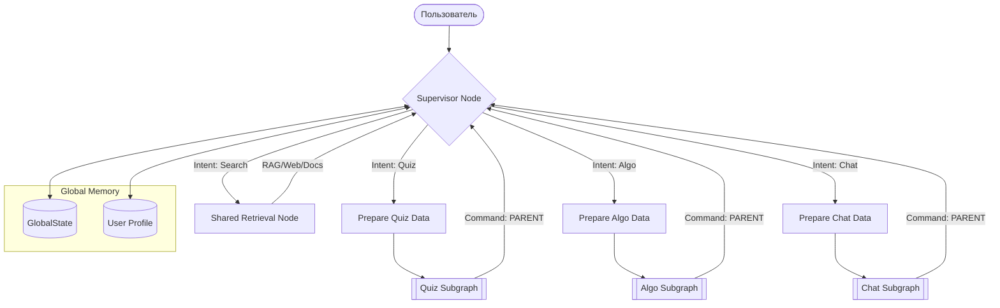
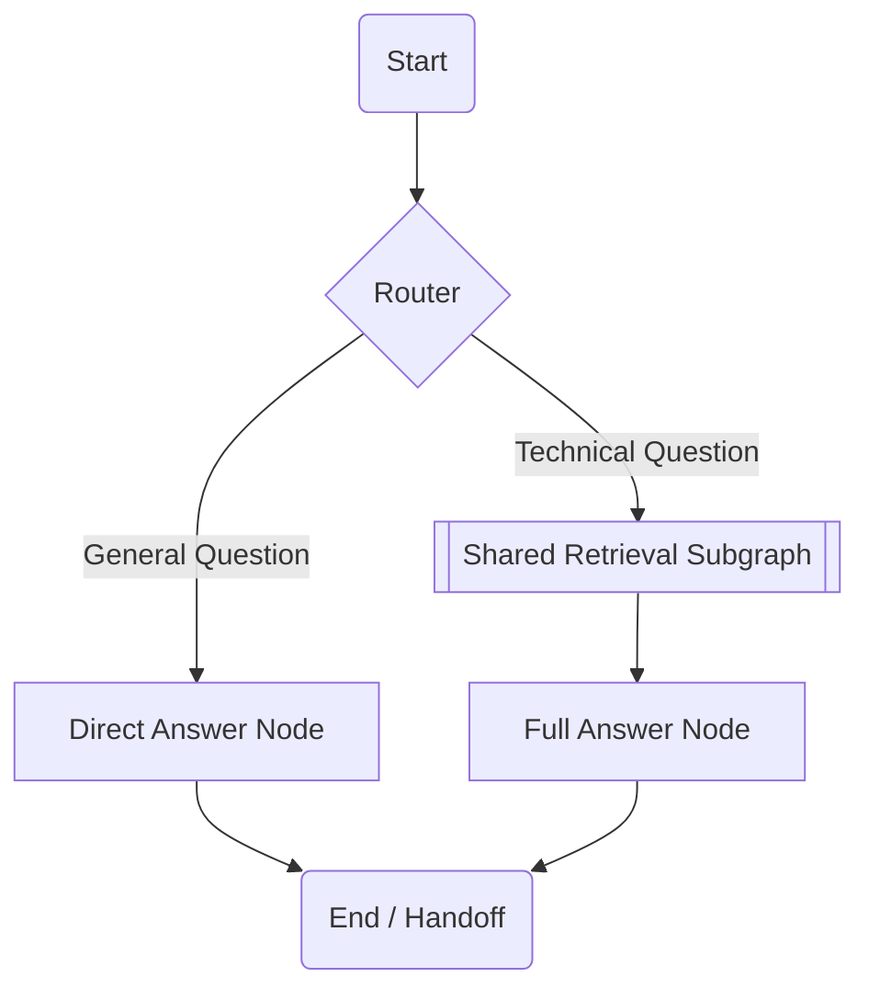
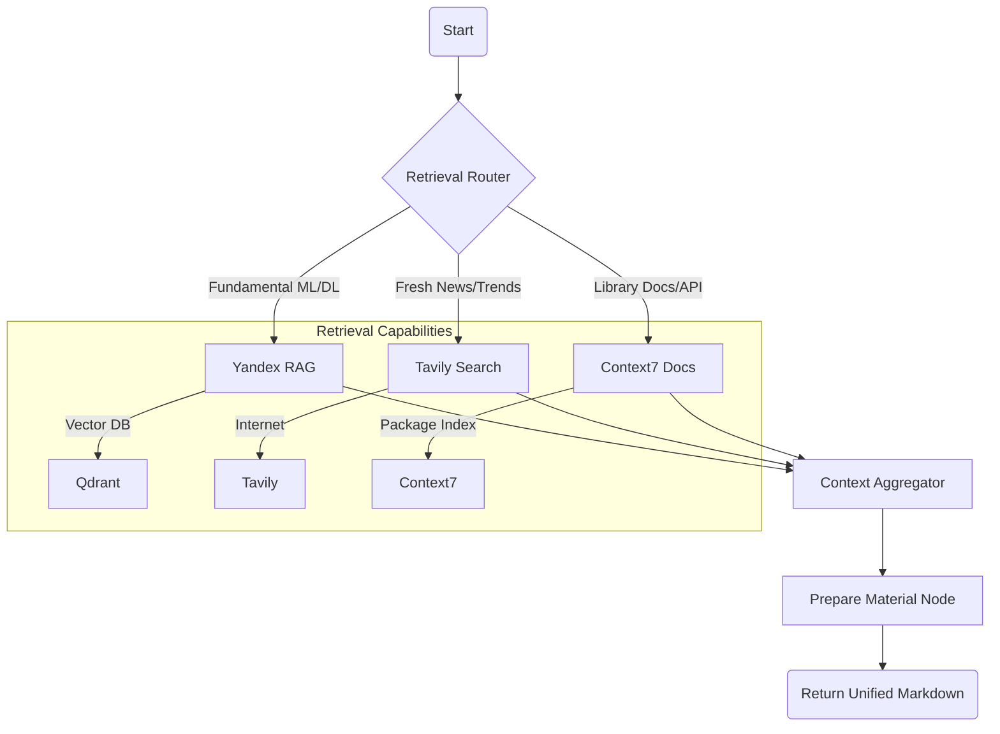
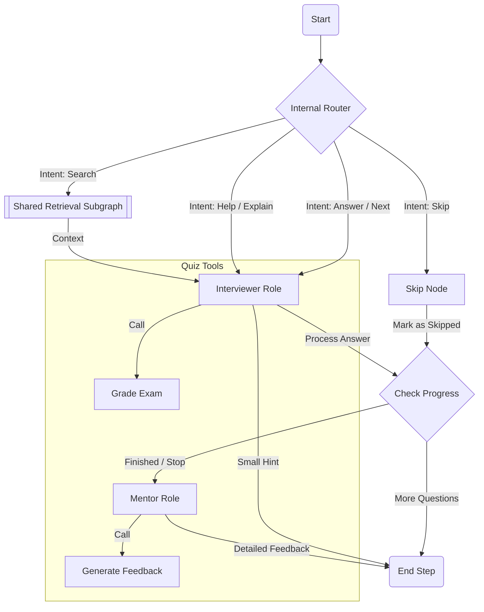
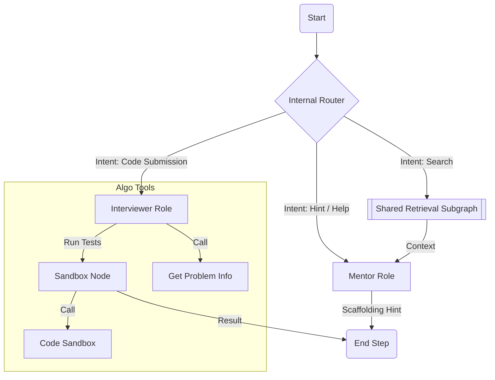

# Документация по агенту NetRunner (Архитектура 2026)

## 1. Введение

NetRunner — это продвинутый образовательный AI-агент, построенный на базе фреймворка **LangGraph** с использованием паттерна **"Router-driven Subgraphs"**. Эта архитектура обеспечивает модульность, изоляцию контекста и возможность динамического переключения ролей.

## 2. Архитектура системы

Система реализована как иерархический граф, где главный оркестратор управляет специализированными подграфами.

### 2.1 Supervisor Graph (Оркестратор)

Главный граф отвечает за маршрутизацию и управление глобальной памятью.

```mermaid
graph TD
    User([Пользователь]) --> Supervisor{Supervisor Node}
    
    subgraph "Global Memory"
        State[(GlobalState)]
        Profile[(User Profile)]
    end
    
    Supervisor <--> State
    Supervisor <--> Profile
    
    Supervisor --"Intent: Quiz"--> QuizHandoff[Prepare Quiz Data]
    Supervisor --"Intent: Algo"--> AlgoHandoff[Prepare Algo Data]
    Supervisor --"Intent: Chat"--> ChatHandoff[Prepare Chat Data]
    Supervisor --"Intent: Search"--> GlobalSearch[Shared Retrieval Node]
    
    QuizHandoff --> QuizGraph[[Quiz Subgraph]]
    AlgoHandoff --> AlgoGraph[[Algo Subgraph]]
    ChatHandoff --> ChatGraph[[Chat Subgraph]]
    
    GlobalSearch --"RAG/Web/Docs"--> Supervisor
    
    QuizGraph --"Command: PARENT"--> Supervisor
    AlgoGraph --"Command: PARENT"--> Supervisor
    ChatGraph --"Command: PARENT"--> Supervisor
```

**Логика работы:**
1.  **Intent Determination**: Анализирует входящее сообщение и решает, какой режим активировать (Quiz, Algo, Chat) или запустить поиск.
2.  **State Mapping**: Подготавливает данные для подграфа (фильтрует историю, добавляет профиль пользователя).
3.  **Orchestration**: Передает управление подграфу и ожидает возврата через `Command`.
4.  **Profile Update**: На основе результатов работы подграфа обновляет долгосрочную карту компетентностей пользователя.

### 2.2 Chat Subgraph (Свободный диалог)

Режим для общего общения и поиска информации.

```mermaid
graph TD
    C_Start(Start) --> C_Router{Router}
    
    C_Router --"General Question"--> C_Direct[Direct Answer Node]
    C_Router --"Technical Question"--> C_Search[[Shared Retrieval Subgraph]]
    
    C_Search --> C_Generate[Full Answer Node]
    
    C_Direct --> C_End(End / Handoff)
    C_Generate --> C_End
```

**Логика работы:**
1.  **Router**: Классифицирует запрос. Если это "болтовня" — направляет в `Direct Answer`. Если вопрос технический — в `Shared Retrieval`.
2.  **Shared Retrieval**: Вызывает унифицированный подграф поиска для сбора знаний из RAG, Tavily или Context7.
3.  **Direct Answer**: Генерирует быстрый ответ, используя Persona-промпт и внутренние знания модели.
4.  **Full Answer**: Формирует подробный, структурированный ответ на основе материалов, подготовленных подграфом поиска.

### 2.5 Shared Retrieval Subgraph (Поиск информации)

Унифицированный подграф для сбора знаний из множества источников.

```mermaid
graph TD
    S_Start(Start) --> S_Router{Retrieval Router}
    
    S_Router --"Fundamental ML/DL"--> S_RAG[Yandex RAG]
    S_Router --"Fresh News/Trends"--> S_Web[Tavily Search]
    S_Router --"Library Docs/API"--> S_Docs[Context7 Docs]
    
    S_RAG --> S_Aggregator[Context Aggregator]
    S_Web --> S_Aggregator
    S_Docs --> S_Aggregator
    
    S_Aggregator --> S_Prepare[Prepare Material Node]
    S_Prepare --> S_End(Return Unified Markdown)
    
    subgraph "Retrieval Capabilities"
        S_RAG --"Vector DB"--> Qdrant
        S_Web --"Internet"--> Tavily
        S_Docs --"Package Index"--> Context7
    end
```

**Логика работы:**
1.  **Router**: LLM анализирует запрос и решает, какие инструменты поиска активировать (можно несколько одновременно).
2.  **Aggregator**: Собирает сырые фрагменты (chunks) из всех выбранных источников.
3.  **Prepare Material**: Узел-"редактор", который синтезирует связный учебный текст, исправляет формулы LaTeX и удаляет дубликаты.

### 2.3 Quiz Subgraph (Тестирование)

Режим проведения квизов с разделением ролей интервьюера (процесс) и ментора (результат).

```mermaid
graph TD
    Q_Start(Start) --> Q_Router{Internal Router}
    
    Q_Router --"Intent: Answer / Next"--> Q_Interviewer[Interviewer Role]
    Q_Router --"Intent: Help / Explain"--> Q_Interviewer
    Q_Router --"Intent: Skip"--> Q_Skip[Skip Node]
    Q_Router --"Intent: Search"--> Q_Search[[Shared Retrieval Subgraph]]
    
    Q_Interviewer --"Process Answer"--> Q_Check{Check Progress}
    Q_Interviewer --"Small Hint"--> Q_End(End Step)
    
    Q_Skip --"Mark as Skipped"--> Q_Check
    
    Q_Check --"More Questions"--> Q_End
    Q_Check --"Finished / Stop"--> Q_Mentor[Mentor Role]
    
    Q_Search --"Context"--> Q_Interviewer
    Q_Mentor --"Detailed Feedback"--> Q_End
    
    subgraph "Quiz Tools"
        Q_Interviewer --"Call"--> Tool_Grade[Grade Exam]
        Q_Mentor --"Call"--> Tool_Gen[Generate Feedback]
    end
```

**Логика работы:**
1.  **Internal Router**: Направляет поток в зависимости от действий пользователя.
2.  **Interviewer**: Ведет процесс квиза. Принимает ответы, дает небольшие уточнения (используя `Shared Retrieval`), но не раскрывает правильный ответ до завершения.
3.  **Skip**: Фиксирует пропуск вопроса без ответа и инициирует переход к следующему.
4.  **Mentor**: Активируется только после завершения квиза (или по требованию "Стоп"). Проводит глубокий разбор всех ответов, дает развернутую обратную связь и правильные решения.

### 2.4 Algo Subgraph (Алгоритмы)

Режим решения задач с использованием Code Sandbox.

```mermaid
graph TD
    A_Start(Start) --> A_Router{Internal Router}
    
    A_Router --"Intent: Code Submission"--> A_Interviewer[Interviewer Role]
    A_Router --"Intent: Hint / Help"--> A_Mentor[Mentor Role]
    A_Router --"Intent: Search"--> A_Search[[Shared Retrieval Subgraph]]
    
    A_Interviewer --"Run Tests"--> A_Sandbox[Sandbox Node]
    A_Sandbox --"Result"--> A_End(End Step)
    
    A_Mentor --"Scaffolding Hint"--> A_End
    A_Search --"Context"--> A_Mentor
    
    subgraph "Algo Tools"
        A_Interviewer --"Call"--> Tool_Problem[Get Problem Info]
        A_Sandbox --"Call"--> Tool_Exec[Code Sandbox]
    end
```

**Логика работы:**
1.  **Internal Router**: Разделяет попытки сдачи кода и запросы на помощь.
2.  **Interviewer**: Запускает код в безопасной песочнице и возвращает результаты тестов.
3.  **Mentor**: Объясняет ошибки и дает наводки на решение, используя `Shared Retrieval`.

## 3. Управление состоянием (Scoped State)

Мы используем стратегию **Scoped State** для изоляции контекста.

*   **GlobalState**: Хранит `messages` (полная история), `user_profile` (компетенции), `active_mode`.
*   **SubgraphState**: Хранит только локальные данные (например, `current_question_index` для квиза).

**Маппинг (Handoff):**
При переходе в подграф `Supervisor` передает только необходимые данные. При выходе подграф возвращает результаты через `Command(graph=Command.PARENT)`, которые обновляют глобальный профиль пользователя.

## 4. Ролевая модель

Агент динамически меняет Persona:
1.  **Core Identity**: Базовый эксперт (всегда в `SystemMessage`).
2.  **Task Identity**: Специализация (Examiner, Mentor, Interviewer) в зависимости от узла.

## 5. Персистентность

Благодаря механизму **Checkpointing** в LangGraph, состояние каждого подграфа сохраняется. Пользователь может прервать сессию и продолжить с того же места, используя тот же `thread_id`.