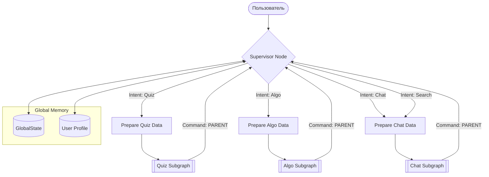
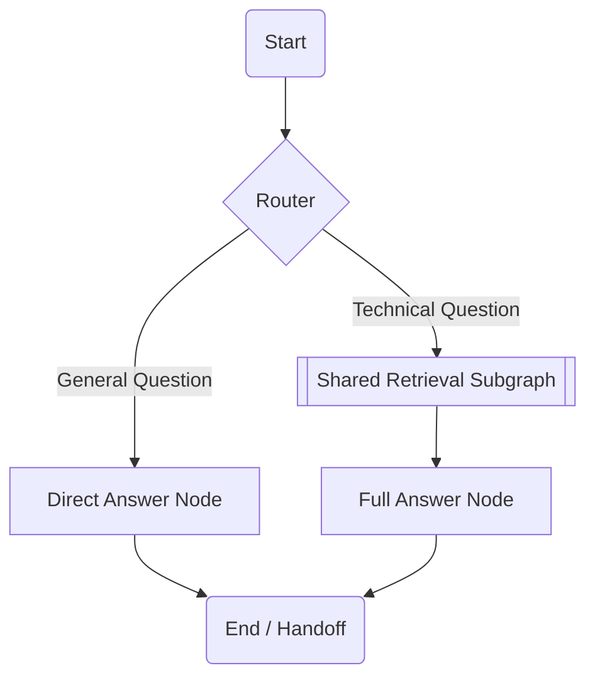
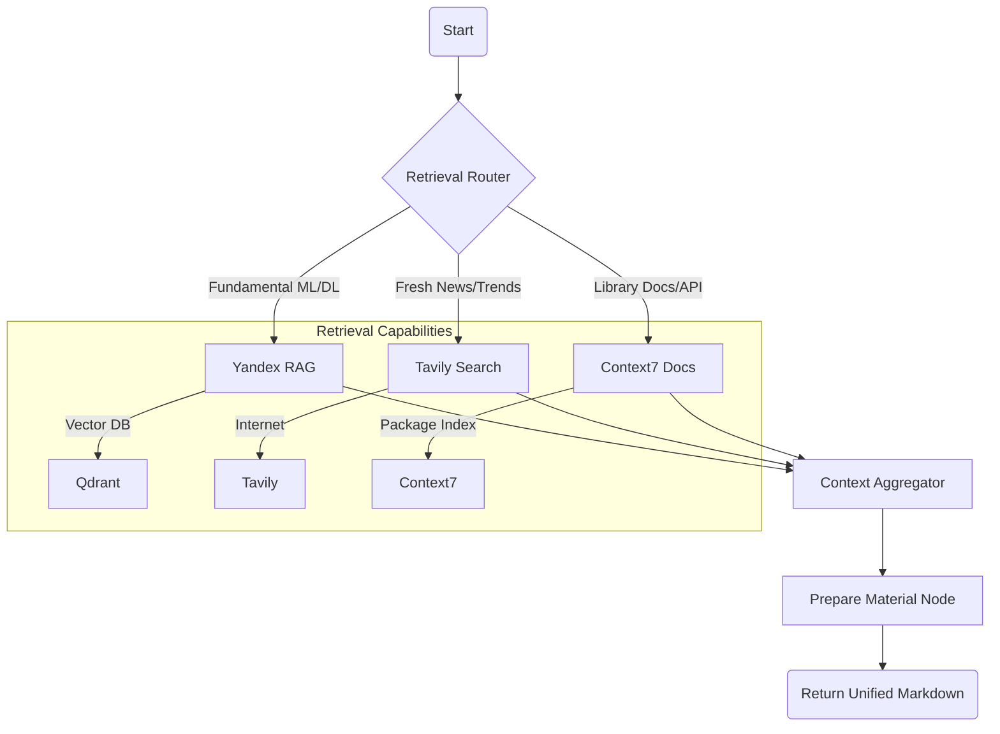
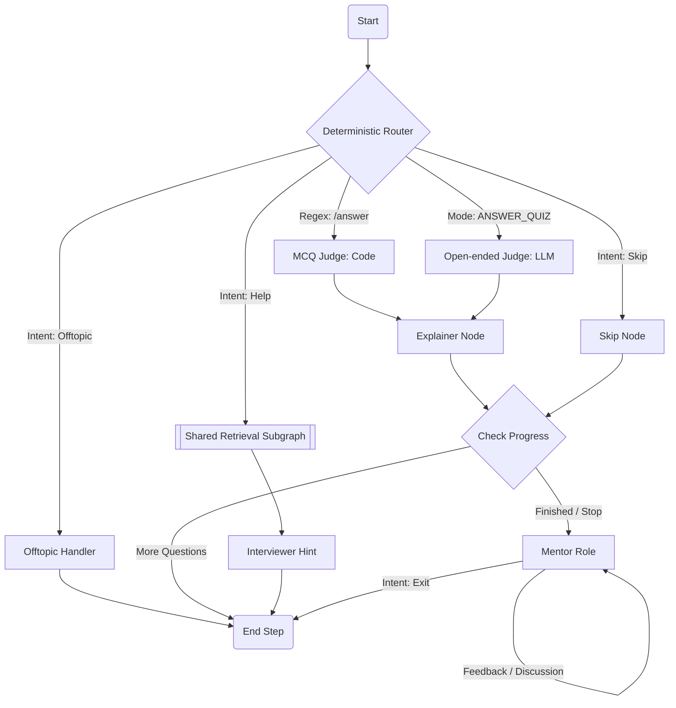
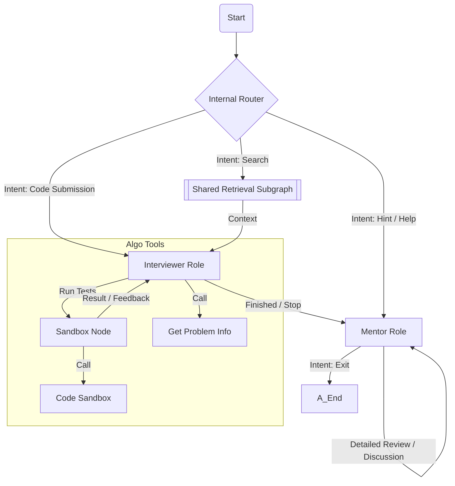

# Документация по агенту NetRunner (Архитектура 2026)

## 1. Введение

NetRunner — это продвинутый образовательный AI-агент, построенный на базе фреймворка **LangGraph** с использованием паттерна **"Router-driven Subgraphs"**. Эта архитектура обеспечивает модульность, изоляцию контекста и возможность динамического переключения ролей.

## 2. Архитектура системы

Система реализована как иерархический граф, где главный оркестратор управляет специализированными подграфами.

### 2.1 Supervisor Graph (Оркестратор)

Главный граф отвечает за маршрутизацию и управление глобальной памятью.

```mermaid
graph TD
    User([Пользователь]) --> Supervisor{Supervisor Node}
    
    subgraph "Global Memory"
        State[(GlobalState)]
        Profile[(User Profile)]
    end
    
    Supervisor <--> State
    Supervisor <--> Profile
    
    Supervisor --"Intent: Quiz"--> QuizHandoff[Prepare Quiz Data]
    Supervisor --"Intent: Algo"--> AlgoHandoff[Prepare Algo Data]
    Supervisor --"Intent: Chat"--> ChatHandoff[Prepare Chat Data]
    Supervisor --"Intent: Search"--> ChatHandoff
    
    QuizHandoff --> QuizGraph[[Quiz Subgraph]]
    AlgoHandoff --> AlgoGraph[[Algo Subgraph]]
    ChatHandoff --> ChatGraph[[Chat Subgraph]]
    
    QuizGraph --"Command: PARENT"--> Supervisor
    AlgoGraph --"Command: PARENT"--> Supervisor
    ChatGraph --"Command: PARENT"--> Supervisor
```

**Логика работы:**
1.  **Intent Determination**: Анализирует входящее сообщение и решает, какой режим активировать (Quiz, Algo, Chat) или запустить поиск.
2.  **State Mapping**: Подготавливает данные для подграфа (фильтрует историю, добавляет профиль пользователя).
3.  **Orchestration**: Передает управление подграфу и ожидает возврата через `Command`.
4.  **Profile Update**: На основе результатов работы подграфа обновляет долгосрочную карту компетентностей пользователя.

### 2.2 Chat Subgraph (Свободный диалог)

Режим для общего общения и поиска информации.

```mermaid
graph TD
    C_Start(Start) --> C_Router{Router}
    
    C_Router --"General Question"--> C_Direct[Direct Answer Node]
    C_Router --"Technical Question"--> C_Search[[Shared Retrieval Subgraph]]
    
    C_Search --> C_Generate[Full Answer Node]
    
    C_Direct --> C_End(End / Handoff)
    C_Generate --> C_End
```

**Логика работы:**
1.  **Router**: Классифицирует запрос. Если это "болтовня" — направляет в `Direct Answer`. Если вопрос технический — в `Shared Retrieval`.
2.  **Shared Retrieval**: Вызывает унифицированный подграф поиска для сбора знаний из RAG, Tavily или Context7.
3.  **Direct Answer**: Генерирует быстрый ответ, используя Persona-промпт и внутренние знания модели.
4.  **Full Answer**: Формирует подробный, структурированный ответ на основе материалов, подготовленных подграфом поиска.

### 2.5 Shared Retrieval Subgraph (Поиск информации)

Унифицированный подграф для сбора знаний из множества источников.
Реализует паттерн **"Retrieval as a Function"** (см. LangGraph docs): принимает запрос и возвращает структурированный материал, оставляя формирование финального ответа вызывающему подграфу.

```mermaid
graph TD
    S_Start(Start) --> S_Router{Retrieval Router}
    
    S_Router --"Fundamental ML/DL"--> S_RAG[Yandex RAG]
    S_Router --"Fresh News/Trends"--> S_Web[Tavily Search]
    S_Router --"Library Docs/API"--> S_Docs[Context7 Docs]
    
    S_RAG --> S_Aggregator[Context Aggregator]
    S_Web --> S_Aggregator
    S_Docs --> S_Aggregator
    
    S_Aggregator --> S_Prepare[Prepare Material Node]
    S_Prepare --> S_End(Return Unified Markdown)
    
    subgraph "Retrieval Capabilities"
        S_RAG --"Vector DB"--> Qdrant
        S_Web --"Internet"--> Tavily
        S_Docs --"Package Index"--> Context7
    end
```

**Логика работы:**
1.  **Router**: LLM анализирует запрос и решает, какие инструменты поиска активировать (можно несколько одновременно).
2.  **Aggregator**: Собирает сырые фрагменты (chunks) из всех выбранных источников.
3.  **Prepare Material**: Узел-"редактор", который синтезирует связный учебный текст, исправляет формулы LaTeX и удаляет дубликаты.

#### Интеграция с другими подграфами

Retrieval Subgraph используется во всех режимах работы агента:

*   **Chat Subgraph**:
    *   Используется для поиска ответа на технические вопросы (`Intent: Search`).
    *   `Retrieval` находит материал -> `Full Answer Node` формирует развернутый ответ пользователю.
*   **Quiz Subgraph (Этапы)**:
    1.  **Quiz Generator**: Поиск учебного материала по теме -> `Exam Generation` (создание вопросов на основе найденного).
    2.  **Quiz Interviewer**: Поиск подсказки при затруднении (`Intent: Help`) -> `Hint Node` (наводящая подсказка, не раскрывающая ответ).
    3.  **Quiz Mentor**: (Планируется) Поиск объяснения ошибок -> `Detailed Feedback` (разбор полетов с ссылками на источники).

### 2.3 Quiz Subgraph (Тестирование v3.5)

Режим проведения квизов с гибридной оценкой и детерминированным роутингом.

```mermaid
graph TD
    Q_Start(Start) --> Q_Router{Deterministic Router}
    
    Q_Router --"Regex: /answer"--> Q_MCQ[MCQ Judge: Code]
    Q_Router --"Mode: ANSWER_QUIZ"--> Q_Open[Open-ended Judge: LLM]
    Q_Router --"Intent: Skip"--> Q_Skip[Skip Node]
    Q_Router --"Intent: Help"--> Q_Search[[Shared Retrieval Subgraph]]
    Q_Router --"Intent: Offtopic"--> Q_Offtopic[Offtopic Handler]
    
    Q_MCQ --> Q_Explain[Explainer Node]
    Q_Open --> Q_Explain
    
    Q_Search --> Q_Hint[Interviewer Hint]
    
    Q_Explain --> Q_Check{Check Progress}
    Q_Skip --> Q_Check
    Q_Offtopic --> Q_End
    
    Q_Check --"More Questions"--> Q_End(End Step)
    Q_Check --"Finished / Stop"--> Q_Mentor[Mentor Role]
    
    Q_Hint --> Q_End
    Q_Mentor --"Feedback / Discussion"--> Q_Mentor
    Q_Mentor --"Intent: Exit"--> Q_End
```

**Логика работы:**
1.  **Deterministic Router**: Обеспечивает безошибочное разделение потоков данных.
    *   Ответы из интерфейса (`/answer [indices]`) и текстовые ответы в режиме `ANSWER_QUIZ` направляются напрямую к судьям.
    *   Запрос подсказки (`help`) активирует поиск через `Shared Retrieval` -> `Interviewer Hint`.
    *   Слэш-команды (`/skip`, `/finish`) обрабатываются алгоритмически.
    *   Оффтоп и запросы нового квиза внутри активного отклоняются `Offtopic Handler`.
2.  **Hybrid Judges (Система оценки)**:
    *   **MCQ Judge**: Выполняет мгновенную программную проверку индексов (Single/Multiple Choice).
    *   **Open-ended Judge**: Реализует паттерн **LLM-as-a-Judge**, сравнивая семантику ответа пользователя с эталоном. Возвращает `score` (0-1) и `reasoning`.
3.  **Explainer**: Узел закрепления знаний. После каждой оценки генерирует краткое экспертное пояснение, помогая студенту сразу понять свои ошибки.
4.  **Interviewer Hint**: Работает в связке с `Shared Retrieval`. Дает наводки на основе учебных материалов, сохраняя интригу и не раскрывая правильный ответ.
5.  **Mentor**: Финальный аналитик. Использует накопленную в `quiz_history` прослеживаемость (traceability) — оценки, обоснования судей и пояснения — для создания персонализированного отчета об успеваемости.

**Ключевые поля состояния (QuizState):**
*   `quiz_history`: Список всех событий квиза с детальным обоснованием каждой оценки.
*   `last_evaluation`: Метаданные последней проверки для узла Explainer.
*   `interaction_mode`: Глобальный переключатель контекста (Чат vs Ответ на тест).

### 2.4 Algo Subgraph (Алгоритмы)

Режим решения задач с использованием Code Sandbox.

```mermaid
graph TD
    A_Start(Start) --> A_Router{Internal Router}
    
    A_Router --"Intent: Code Submission"--> A_Interviewer[Interviewer Role]
    A_Router --"Intent: Hint / Help"--> A_Mentor[Mentor Role]
    A_Router --"Intent: Search"--> A_Search[[Shared Retrieval Subgraph]]
    
    A_Interviewer --"Run Tests"--> A_Sandbox[Sandbox Node]
    A_Sandbox --"Result / Feedback"--> A_Interviewer
    A_Interviewer --"Finished / Stop"--> A_Mentor[Mentor Role]
    
    A_Mentor --"Detailed Review / Discussion"--> A_Mentor
    A_Mentor --"Intent: Exit"--> A_End
    
    A_Search --"Context"--> A_Interviewer
    
    subgraph "Algo Tools"
        A_Interviewer --"Call"--> Tool_Problem[Get Problem Info]
        A_Sandbox --"Call"--> Tool_Exec[Code Sandbox]
    end
```

**Логика работы:**
1.  **Internal Router**: Разделяет попытки сдачи кода, запросы на помощь и оценку сложности.
2.  **Interviewer**: Ведет процесс интервью. Запускает код в безопасной песочнице, проверяет оценки сложности (время/память) и возвращает результаты тестов. Если оценки неверны — сообщает об этом, но не называет правильных. Дает небольшие наводки через `Shared Retrieval`.
3.  **Mentor**: Активируется после завершения задачи (или по требованию "Стоп"). Проводит глубокий разбор решения, обсуждает альтернативные подходы и помогает пользователю вырасти как инженеру. Остается в активном состоянии для обсуждения, пока сессия не будет закрыта.

## 3. Управление состоянием (Scoped State)

Мы используем стратегию **Scoped State** для изоляции контекста.

*   **GlobalState**: Хранит `messages` (полная история), `user_profile` (компетенции), `active_mode`.
*   **SubgraphState**: Хранит только локальные данные (например, `current_question_index` для квиза).

**Маппинг (Handoff):**
При переходе в подграф `Supervisor` передает только необходимые данные. При выходе подграф возвращает результаты через `Command(graph=Command.PARENT)`, которые обновляют глобальный профиль пользователя.

## 4. Ролевая модель

Агент динамически меняет Persona:
1.  **Core Identity**: Базовый эксперт (всегда в `SystemMessage`).
2.  **Task Identity**: Специализация (Examiner, Mentor, Interviewer) в зависимости от узла.

## 5. Персистентность

Благодаря механизму **Checkpointing** в LangGraph, состояние каждого подграфа сохраняется. Пользователь может прервать сессию и продолжить с того же места, используя тот же `thread_id`.