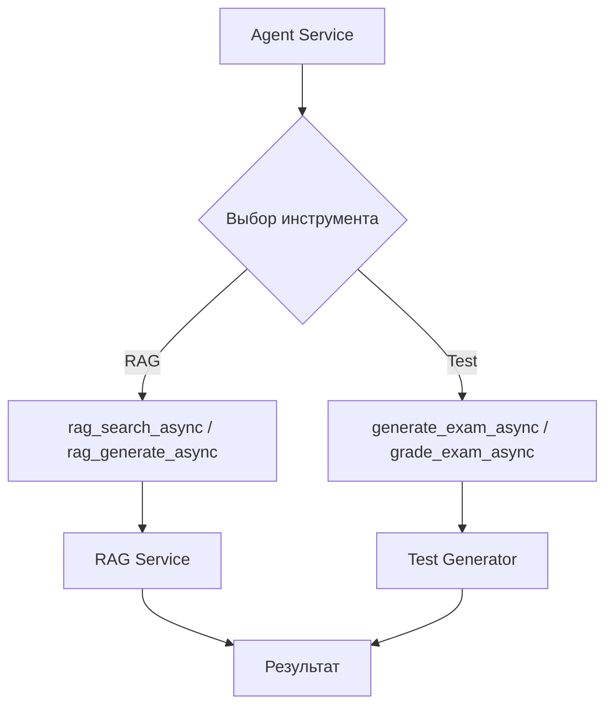

# Настройка асинхронных инструментов (Async Tools)

## Обзор

Система предоставляет асинхронные инструменты для работы с RAG и Test Generator сервисами через модуль `langchain_tools.py`.

## Доступные инструменты

### RAG Инструменты
- `rag_search_async` — асинхронный поиск по векторной базе
- `rag_generate_async` — асинхронная генерация ответов

### Test Generator Инструменты
- `generate_exam_async` — асинхронная генерация тестов
- `grade_exam_async` — асинхронная проверка ответов

## Диаграмма работы



## Конфигурация

### Файлы настройки

**См. также:**
- [`agent_service/app_settings.json`](../app_settings.json) — основная конфигурация
- [`agent_service/.env`](../.env) — переменные окружения агента
- [`test_generator/.env`](../../test_generator/.env) — переменные окружения тест-генератора

### Ключевые параметры

| Параметр | Файл | Описание |
|----------|------|----------|
| `rag_service_url` | `app_settings.json` | URL RAG сервиса |
| `test_generator_service_url` | `app_settings.json` | URL Test Generator (порт 52812) |
| `concurrency_limit` | `app_settings.json` | Лимит параллельных запросов |
| `OPENAI_API_KEY` | `test_generator/.env` | Ключ OpenAI API |
| `PORT` | `test_generator/.env` | Порт Test Generator (должен быть 52812) |

## Использование

### Импорт

```python
from agent_service.langchain_tools import (
    rag_search_async,
    rag_generate_async,
    generate_exam_async,
    grade_exam_async
)
```

### Примеры

**RAG поиск:**
```python
result = await rag_search_async("Тема для поиска")
```

**Генерация теста:**
```python
exam = await generate_exam_async(
    topic="Python Async",
    difficulty="medium",
    count=5
)
```

## Проверка работоспособности

```bash
# RAG сервис
curl http://rag-api:8000/health

# Test Generator
curl http://llm-tester-api:52812/health
```

## Типичные проблемы

| Проблема | Причина | Решение |
|----------|---------|---------|
| 500 ошибка от Test Generator | Отсутствует OPENAI_API_KEY | Добавить ключ в `test_generator/.env` |
| 500 ошибка от Test Generator | Неправильный порт | Установить `PORT=52812` |
| Сетевые таймауты | Сервисы не готовы | Увеличить таймауты в `app_settings.json` |

## См. также

- [`langchain_tools.py`](../langchain_tools.py) — реализация инструментов
- [Тесты](../tests/addititional/) — примеры использования
