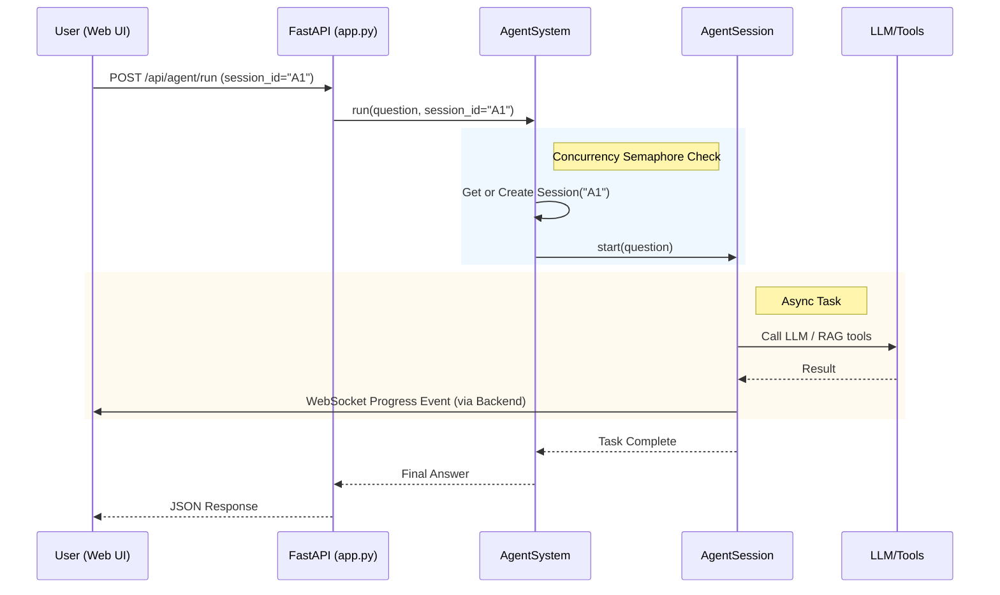

# Механизм многопользовательской работы и управления сессиями

В данном документе описана архитектура обработки одновременных запросов от нескольких пользователей в сервисе агента (`agent_service`). Система построена на базе **асинхронного ввода-вывода (asyncio)** и обеспечивает строгую изоляцию контекста для каждого пользователя.

## 1. Архитектура управления сессиями

Центральным компонентом системы является класс `AgentSystem` (см. `agent_service/agent_system.py`), который выполняет роль реестра и диспетчера сессий.

### Основные компоненты

1.  **AgentSystem (Реестр)**
    *   Хранит словарь активных сессий: `self.sessions: Dict[str, AgentSession]`.
    *   Ключом является `session_id` — уникальный идентификатор (например, UUID), который приходит от клиента (Web UI).
    *   Отвечает за создание новых сессий, получение существующих и удаление устаревших.

2.  **AgentSession (Контекст пользователя)**
    *   Представляет собой изолированный экземпляр работы с одним пользователем (см. `agent_service/agent_session.py`).
    *   Хранит **состояние (State)**: текущий вопрос, историю диалога, найденные документы, прогресс квиза.
    *   Хранит **историю событий**: список последних уведомлений (progress events), отправленных на фронтенд.
    *   Имеет собственные механизмы блокировки для предотвращения гонки данных внутри одной сессии.

## 2. Привязка сессий к пользователям

В системе реализована жесткая связь между пользователем и его сессиями:

1.  **Генерация ID**: При создании нового чата `web_ui_service/backend` генерирует уникальный `session_id` по шаблону: `{username}_{random_hash}` (например, `anton_a1b2c3d4`).
2.  **Регистрация в БД**: Каждая новая сессия регистрируется в `user_service` в таблице `chat_sessions`, где она навсегда привязывается к `user_id`.
3.  **Лимиты сессий**: Для каждого пользователя установлено ограничение на количество хранимых сессий (параметр `max_user_sessions`, по умолчанию **10**). При создании 11-й сессии самая старая сессия пользователя автоматически удаляется из базы данных.
4.  **Безопасность и Роли**:
    *   **Обычный пользователь (User)**: Видит и может загружать только те сессии, владельцем которых он является в БД.
    *   **Разработчик (Developer)**: Имеет расширенный доступ, позволяющий видеть системные сессии и сессии, начинающиеся с префикса `test_` (используются в интеграционных тестах).
4.  **Единый источник правды**: `user_service` является владельцем метаданных сессий (названия, даты), в то время как `agent_service` отвечает за временное хранение состояния активного диалога.

## 3. Изоляция данных

Изоляция данных между пользователями обеспечивается на двух уровнях:

1.  **Уровень объектов Python**:
    *   Каждый запрос обрабатывается в контексте своего объекта `AgentSession`.
    *   Переменные состояния (`AgentState`) хранятся в атрибутах конкретного экземпляра сессии, поэтому данные одного пользователя физически не могут быть доступны другому.

2.  **Уровень LangGraph**:
    *   При запуске графа выполнения (`_run_graph`) передается конфигурация с уникальным `thread_id`, равным `session_id`.
    *   Компонент `MemorySaver` использует этот `thread_id` для сохранения чекпоинтов (истории шагов агента). Это позволяет агенту "помнить" контекст разговора именно с этим пользователем.

## 3. Управление конкурентностью (Concurrency Control)

Сервис использует несколько механизмов для эффективной обработки параллельных запросов и защиты от перегрузок:

### Асинхронность (Asyncio)
Весь сервис (FastAPI + LangChain tools) работает в асинхронном режиме. Это позволяет одному процессу Python обрабатывать множество одновременных соединений, не блокируя поток выполнения во время ожидания ответов от внешних API (OpenAI, RAG, БД).

### Глобальное ограничение (Semaphore)
В `AgentSystem` реализован семафор `self._concurrency_sem`, ограничивающий количество **одновременно выполняемых тяжелых задач** (например, генерации ответа LLM).
*   **Лимит**: Определяется настройкой `concurrency_limit` (по умолчанию 2).
*   **Принцип**: Если лимит исчерпан, новые запросы становятся в очередь (await) и ожидают освобождения слота. Это защищает сервер и внешние API от пиковых нагрузок.

### Блокировка сессии (Session Lock)
Внутри каждого `AgentSession` используется `asyncio.Lock`.
*   **Зачем**: Предотвращает состояние гонки, если пользователь отправит несколько сообщений подряд очень быстро.
*   **Принцип**: Второй запрос будет ожидать завершения обработки первого запроса в рамках той же сессии.

## 4. Жизненный цикл и очистка ресурсов

Для управления памятью реализован механизм автоматической очистки ("сборщик мусора"):

1.  **TTL (Time To Live)**: Каждая сессия имеет время жизни (по умолчанию 600 секунд / 10 минут). Время обновляется (`touch()`) при любой активности пользователя.
2.  **Фоновый Sweeper**: Задача `_sweep_expired_sessions_loop` запускается при старте системы и работает в фоне.
3.  **Очистка**: Каждые 30 секунд Sweeper проверяет время последней активности всех сессий и удаляет те, чей возраст превысил TTL. Это освобождает память от неактивных пользователей.

## 5. Схема потока данных

## 6. Емкость и масштабируемость (Сколько пользователей одновременно?)

Количество одновременных пользователей в текущей реализации ограничено двумя факторами: **активными вычислениями** и **памятью**.

### Активные пользователи (Active Processing)
Это пользователи, для которых агент прямо сейчас генерирует ответ или выполняет поиск.
*   **Лимит**: Определяется параметром `concurrency_limit` в `settings.py` (по умолчанию **5**).
*   **Что происходит при превышении**: Если 10 пользователей одновременно нажмут "Отправить", первые 5 начнут обрабатываться сразу, а остальные 5 будут ждать в очереди (на уровне семафора асинхронной задачи). Как только один из первых пяти закончит, следующий из очереди возьмется в работу.
*   **Зачем это нужно**: Защита от лимитов (Rate Limits) API провайдеров (OpenAI/Z.ai) и предотвращение перегрузки CPU.

### Подключенные пользователи (Idle Sessions)
Это пользователи, у которых открыт чат, есть история переписки, но они сейчас ничего не печатают.
*   **Лимит**: Ограничен только оперативной памятью сервера (RAM).
*   **Оценка**: Каждая сессия занимает от нескольких КБ до пары МБ (в зависимости от длины истории). На обычном сервере с 1 ГБ RAM можно держать **тысячи** таких сессий одновременно.
*   **Очистка**: Благодаря TTL (10 минут), неактивные пользователи автоматически удаляются из памяти, освобождая место для новых.

### Резюме по емкости
| Тип нагрузки | Лимит (дефолт) | Как увеличить |
| :--- | :--- | :--- |
| **Одновременная генерация** | 5 пользователей | Увеличить `concurrency_limit` в `app_settings.json` (требует мощного CPU и высоких лимитов API) |
| **Активные диалоги (в памяти)** | ~1000+ пользователей | Увеличить RAM сервера или уменьшить `session_ttl_seconds` |

## Резюме архитектуры

Архитектура обеспечивает:
*   **Масштабируемость**: Благодаря асинхронности сервис может обслуживать множество "спящих" пользователей одновременно.
*   **Безопасность**: Данные пользователей строго изолированы через `session_id`.
*   **Стабильность**: Семафоры предотвращают "падение" сервиса при наплыве запросов.
*   **Эффективность**: Автоматическая очистка ресурсов предотвращает утечки памяти.