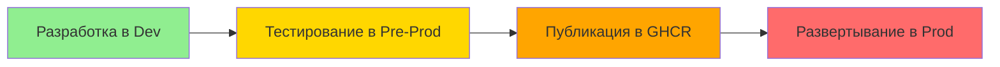

# Docker Deployment Guide

Этот документ описывает систему развертывания agent_service с использованием Docker для development, pre-production и production сред.

## Структура файлов

```
agent_service/
├── app_settings-dev.json      # Конфиг для разработки (порт 8250, is_dev_version: true)
├── app_settings-prod.json     # Конфиг для продакшена (порт 8270, is_dev_version: false)
├── Dockerfile-dev             # Dockerfile для разработки
├── Dockerfile-prod            # Dockerfile для продакшена
├── docker-compose-dev.yml     # Docker Compose для разработки (agent_dev)
├── docker-compose-preprod.yml # Docker Compose для pre-prod (agent_preprod)
├── docker-compose-prod.yml    # Docker Compose для продакшена (agent_prod)
├── agent_system.py            # Основной код (поддерживает --settings, показывает индикатор версии)
├── app.py                     # API сервер (поддерживает --settings)
└── docs/
    └── docker_deployment.md  # Эта документация
```

## Индикатор версии

В логах и API ответах отображается индикатор версии:
- **Dev версия**: Показывает в логах "⚠️ Это dev версия агента"
- **Pre-prod версия**: Показывает "⚠️ Это pre-production версия агента"
- **Prod версия**: Без индикатора

Это помогает визуально отличить среды при одновременной работе.

---

## 🔄 Workflow: Development → Pre-Production → Production

### Полный цикл разработки и релиза:



### 1. Development Phase
**Цель**: Быстрая разработка с hot reload
```bash
cd agent_service
docker compose -f docker-compose-dev.yml up --build
```
- Порт: 8250
- Код монтируется через volume
- Hot reload активен

### 2. Pre-Production Phase
**Цель**: Тестирование prod-сборки перед релизом
```bash
# Собираем prod-образ
cd agent_service
docker build -f Dockerfile-prod -t agent_service:preprod .

# Запускаем pre-prod
docker compose -f docker-compose-preprod.yml up
```
- Порт: 8250 (тот же, что и dev)
- Код внутри образа (как в prod)
- Изолированная сеть `web_ui_network_preprod`

### 3. Production Phase
**Цель**: Production для пользователей
```bash
# Публикация в GHCR
docker tag agent_service:preprod ghcr.io/lifelong-learning-assisttant/agent_service:v002
docker push ghcr.io/lifelong-learning-assisttant/agent_service:v002

# Запуск prod
docker compose -f docker-compose-prod.yml up
```
- Порт: 8270
- Образ из GHCR
- Стабильная работа

---

## 🔹 Development Mode

### Назначение
- Быстрая разработка с горячей перезагрузкой кода
- Изменения в коде отражаются автоматически без пересборки контейнера
- Используется для отладки и тестирования новых функций

### Как использовать

**1. Запуск сервиса:**
```bash
cd agent_service
docker compose -f docker-compose-dev.yml up --build
```

**2. Особенности:**
- Порт: 8250
- Имя сервиса: `agent_dev`
- Код монтируется через volume: `./:/app`
- Изменения в файлах `.py` сразу отражаются в контейнере
- Использует `app_settings-dev.json`
- Команда запуска: `uv run python app.py --settings app_settings-dev.json`

**3. Остановка:**
```bash
docker compose -f docker-compose-dev.yml down
```

### Технические детали

**Dockerfile-dev:**
```dockerfile
FROM python:3.13-slim
WORKDIR /app
RUN pip install uv
COPY pyproject.toml uv.lock ./
RUN uv sync
COPY . .  # Копирование кода
CMD ["uv", "run", "python", "app.py"]
```

**docker-compose-dev.yml:**
```yaml
services:
  agent_dev:
    build:
      context: .
      dockerfile: Dockerfile-dev
    ports:
      - "8250:8250"
    volumes:
      - .:/app  # Hot reload
    environment:
      - AGENT_PORT=8250
      - WEB_UI_URL=http://web_ui_service-backend-dev:8351
    networks:
      - web_ui_network_dev
      - rag_rag_network
      - test_generator_default
```

---

## 🟡 Pre-Production Mode (NEW!)

### Назначение
- **Тестирование prod-сборки** перед релизом
- Проверка что prod-образы работают корректно
- Тестирование без влияния на пользователей
- Отладка production-конфигурации

### Ключевые особенности

| Аспект | Pre-Prod | Dev | Prod |
|--------|----------|-----|------|
| **Порт** | 8250 | 8250 | 8270 |
| **Код** | Внутри образа | Volume | Внутри образа |
| **Сборка** | Prod Dockerfile | Dev Dockerfile | Prod Dockerfile |
| **Образ** | Локальный preprod | Локальный dev | GHCR |
| **Сеть** | web_ui_network_preprod | web_ui_network_dev | web_ui_network_prod |
| **Цель** | Тестирование prod | Разработка | Пользователи |

### Почему pre-prod важен?

1. **Безопасность**: Можно тестировать prod-сборку не затрагивая пользователей
2. **Изоляция**: Отдельная сеть, не конфликтует с dev и prod
3. **Скорость**: Не нужно публиковать в GHCR для тестирования
4. **Удобство**: Использует тот же порт, что и dev (удобно для тестов)

### Как использовать

**1. Сборка pre-prod образа:**
```bash
cd agent_service
docker build -f Dockerfile-prod -t agent_service:preprod .
```

**2. Запуск pre-prod:**
```bash
docker compose -f docker-compose-preprod.yml up
```

**3. Проверка работы:**
```bash
curl http://localhost:8250/health
```

**4. Остановка:**
```bash
docker compose -f docker-compose-preprod.yml down
```

### Когда использовать pre-prod?

✅ **Используйте pre-prod когда:**
- Закончили разработку фичи в dev
- Хотите проверить prod-сборку
- Нужно протестировать перед релизом
- Хотите убедиться что все работает как в prod

❌ **Не используйте pre-prod когда:**
- Нужно быстро менять код (hot reload)
- Только начинаете разработку
- Нужны dev-инструменты (debug, logs)

---

## 🔸 Production Mode

### Назначение
- Стабильная версия сервиса для развертывания
- Использует заранее собранный Docker образ из GHCR
- Подходит для CI/CD и production сред

### Как использовать

**1. Запуск из GHCR:**
```bash
cd agent_service
docker compose -f docker-compose-prod.yml up
```

**2. Особенности:**
- Порт: 8270
- Имя сервиса: `agent_prod`
- Код ВКЛЮЧЕН в образ (скопирован при сборке)
- Монтируется ТОЛЬКО конфиг: `./app_settings-prod.json:/app/app_settings.json:ro`
- Использует `app_settings-prod.json`
- Команда запуска: `uv run python app.py --settings app_settings.json`

**3. Остановка:**
```bash
docker compose -f docker-compose-prod.yml down
```

### Технические детали

**Dockerfile-prod:**
```dockerfile
FROM python:3.13-slim
WORKDIR /app
RUN pip install uv
COPY pyproject.toml uv.lock ./
RUN uv sync --frozen
COPY . .
CMD ["uv", "run", "python", "app.py"]
```

**docker-compose-prod.yml:**
```yaml
services:
  agent_prod:
    image: ghcr.io/lifelong-learning-assisttant/agent_service:v001
    ports:
      - "8270:8270"
    environment:
      - AGENT_PORT=8270
      - WEB_UI_URL=http://web_ui_backend:8151
    networks:
      - web_ui_network_prod
      - rag_rag_network
      - test_generator_default
```

---

## 📦 GitHub Container Registry

### Публикация образа

```bash
# Логин в GHCR
docker login ghcr.io/lifelong-learning-assisttant

# Сборка и тегирование
docker build -f Dockerfile-prod -t ghcr.io/lifelong-learning-assisttant/agent_service:v001 .
docker push ghcr.io/lifelong-learning-assisttant/agent_service:v001

# Запуск из GHCR
docker pull ghcr.io/lifelong-learning-assisttant/agent_service:v001
docker compose -f docker-compose-prod.yml up
```

### Релизная версия

В настоящее время доступна релизная версия Docker-образа:
- `ghcr.io/lifelong-learning-assisttant/agent_service:v001`

---

## 📊 Полное сравнение сред

| Аспект | Development | Pre-Production | Production |
|--------|-------------|----------------|------------|
| **Назначение** | Разработка | Тестирование prod | Пользователи |
| **Порт** | 8250 | 8250 | 8270 |
| **Код** | Volume (hot reload) | Prod-образ (локальный) | Prod-образ из GHCR |
| **Образ** | Локальный dev | Локальный preprod | GHCR |
| **Сеть** | web_ui_network_dev | web_ui_network_preprod | web_ui_network_prod |
| **Сборка** | При каждом запуске | Вручную | Вручную (GHCR) |
| **Публикация** | Нет | Нет | Да (GHCR) |
| **Скорость** | ⚡⚡⚡ Очень быстро | ⚡ Быстро | 🐌 Зависит от сети |
| **Риск** | Низкий (только dev) | Средний (тестирование) | Высокий (пользователи) |

---

## 🔧 Переменные окружения

Все режима используют:
- `PYTHONUNBUFFERED=1` - немедленный вывод логов
- `RAG_SERVICE_URL=http://rag-api:8000` - URL RAG сервиса
- `TEST_GENERATOR_URL=http://test_generator:52812` - URL Test Generator сервиса

**Дополнительно:**
- **Dev**: `WEB_UI_URL=http://web_ui_service-backend-dev:8351`
- **Pre-prod**: `WEB_UI_URL=http://backend:8351` (в сети preprod)
- **Prod**: `WEB_UI_URL=http://web_ui_backend:8151`

---

## ✅ Verification

### Development
```bash
cd agent_service
docker compose -f docker-compose-dev.yml up --build
curl http://localhost:8250/health
docker compose -f docker-compose-dev.yml down
```

### Pre-Production
```bash
# Сборка
cd agent_service
docker build -f Dockerfile-prod -t agent_service:preprod .

# Запуск
docker compose -f docker-compose-preprod.yml up
curl http://localhost:8250/health
docker compose -f docker-compose-preprod.yml down
```

### Production
```bash
cd agent_service
docker compose -f docker-compose-prod.yml up
curl http://localhost:8270/health
docker compose -f docker-compose-prod.yml down
```

### Одновременный запуск всех сред
```bash
# Terminal 1 - Development
cd agent_service
docker compose -f docker-compose-dev.yml up --build

# Terminal 2 - Pre-Production
cd agent_service
docker compose -f docker-compose-preprod.yml up

# Terminal 3 - Production
cd agent_service
docker compose -f docker-compose-prod.yml up
```

Имена контейнеров:
- `agent_service-agent_dev-1` (dev, порт 8250)
- `agent_service-agent_preprod-1` (preprod, порт 8250)
- `agent_service-agent_prod-1` (prod, порт 8270)

---

## ⚠️ Troubleshooting

### Development
**Изменения не отражаются:**
- Проверьте права доступа к файлам
- Убедитесь, что файлы в текущей директории
- Перезапустите контейнер

**Порт занят:**
- Измените порт в docker-compose-dev.yml и app_settings-dev.json

### Pre-Production
**Образ не найден:**
- Убедитесь что preprod-образ собран: `docker images | grep agent_service`

**Порт занят:**
- Остановите dev-контейнеры: `docker compose -f docker-compose-dev.yml down`

### Production
**Образ не найден:**
- `docker compose -f docker-compose-prod.yml pull`

**Ошибка конфигурации:**
- Проверьте путь к app_settings-prod.json

---

## 🌐 Взаимодействие с Web UI

### Dev
- Web UI: http://localhost:8350
- Agent: http://localhost:8250
- Сеть: web_ui_network_dev

### Pre-Prod
- Web UI: http://localhost:8350
- Agent: http://localhost:8250
- Сеть: web_ui_network_preprod

### Prod
- Web UI: http://localhost:8150
- Agent: http://localhost:8270
- Сеть: web_ui_network_prod

**Важно:** Для корректной работы сетей смотрите [network_interaction.md](network_interaction.md).

---

## 📚 Общие сервисы

Агент взаимодействует со следующими сервисами:
- **RAG Service**: Порт 8000
- **Test Generator Service**: Порт 52812
- **Web UI**: Порт 8350 (dev/preprod) / 8150 (prod)

---

## 🎯 Quick Reference

| Команда | Dev | Pre-Prod | Prod |
|---------|-----|----------|------|
| **Запуск** | `up --build` | `up` (после сборки) | `up` |
| **Сборка** | Авто | Вручную | Вручную (GHCR) |
| **Порт** | 8250 | 8250 | 8270 |
| **Hot reload** | ✅ Да | ❌ Нет | ❌ Нет |
| **Использование** | Разработка | Тестирование prod | Пользователи