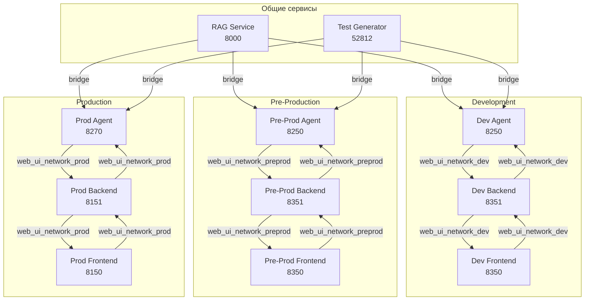

# Документация по сетевому взаимодействию

Этот документ описывает сетевое взаимодействие между сервисом агента и веб-интерфейсом во всех средах: development, pre-production и production.

## Обзор

Система состоит из двух основных сервисов:
- **Сервис агента**: Обрабатывает логику и взаимодействия, связанные с агентом.
- **Веб-интерфейс**: Предоставляет пользовательский интерфейс для взаимодействия с агентом.

Все сервисы имеют три конфигурации:
- **Dev**: Для быстрой разработки с hot reload
- **Pre-prod**: Для тестирования prod-версий перед релизом
- **Prod**: Для production-окружения

## Диаграмма сети



## Среды развертывания

### 1. Development (Dev)

**Назначение**: Быстрая разработка с горячей перезагрузкой кода.

**Особенности**:
- Код монтируется через volume (hot reload)
- Frontend: React собирается внутри контейнера при запуске
- Backend: Python код монтируется напрямую
- Порты: 8250 (agent), 8351 (backend), 8350 (frontend)

**Запуск**:
```bash
# Web UI Service
cd web_ui_service
docker compose -f docker-compose-dev.yml up --build

# Agent Service
cd ../agent_service
docker compose -f docker-compose-dev.yml up --build
```

**Сеть**: `web_ui_network_dev`

### 2. Pre-Production (Pre-Prod)

**Назначение**: Предварительное тестирование prod-версий перед релизом.

**Особенности**:
- Использует те же Dockerfile, что и prod
- Собирает prod-образы с кодом внутри
- Запускается на dev-портах (8250, 8351, 8350)
- Позволяет тестировать prod-сборку без влияния на пользователей
- Изолированная сеть, не конфликтует с dev и prod

**Запуск**:
```bash
# Web UI Service
cd web_ui_service
docker compose -f docker-compose-preprod.yml up --build

# Agent Service
cd ../agent_service
docker compose -f docker-compose-preprod.yml up --build
```

**Сеть**: `web_ui_network_preprod`

**Порты**:
- Frontend: 8350
- Backend: 8351
- Agent: 8250

**Отличие от prod**: Только порты, сеть и имена контейнеров отличаются. Код и конфигурация идентичны prod.

### 3. Production (Prod)

**Назначение**: Production-развертывание для пользователей.

**Особенности**:
- Использует готовые образы из GHCR
- Код внутри образов (не монтируется)
- Порты: 8270 (agent), 8151 (backend), 8150 (frontend)
- Публикация образов в GitHub Container Registry

**Запуск**:
```bash
# Web UI Service
cd web_ui_service
docker compose -f docker-compose-prod.yml up

# Agent Service
cd ../agent_service
docker compose -f docker-compose-prod.yml up
```

**Сеть**: `web_ui_network_prod`

## Сравнение сред

| Аспект | Development | Pre-Production | Production |
|--------|-------------|----------------|------------|
| **Назначение** | Разработка | Тестирование prod | Пользователи |
| **Frontend порт** | 8350 | 8350 | 8150 |
| **Backend порт** | 8351 | 8351 | 8151 |
| **Agent порт** | 8250 | 8250 | 8270 |
| **Сеть** | web_ui_network_dev | web_ui_network_preprod | web_ui_network_prod |
| **Код Frontend** | Сборка в контейнере | Prod-образ | Prod-образ из GHCR |
| **Код Backend** | Volume (hot reload) | Prod-образ | Prod-образ из GHCR |
| **Код Agent** | Volume (hot reload) | Prod-образ | Prod-образ из GHCR |
| **Образы** | Локальные | Локальные | GHCR |
| **Публикация** | Нет | Нет | Да (GHCR) |

## Поток разработки и релиза

### 1. Development Phase
```bash
# Разработка
cd web_ui_service
docker compose -f docker-compose-dev.yml up --build

# Параллельно агент
cd ../agent_service
docker compose -f docker-compose-dev.yml up --build
```

### 2. Pre-Production Testing
```bash
# Собираем prod-образы
cd web_ui_service/frontend
docker build -f Dockerfile-prod -t web_ui_frontend:preprod .
cd ../backend
docker build -f Dockerfile-prod -t web_ui_backend:preprod .

# Запускаем pre-prod
cd ..
docker compose -f docker-compose-preprod.yml up

# Тестируем на портах 8350/8351/8250
```

### 3. Production Release
```bash
# Публикация в GHCR
docker tag web_ui_frontend:preprod ghcr.io/lifelong-learning-assisttant/web_ui_frontend:v002
docker push ghcr.io/lifelong-learning-assisttant/web_ui_frontend:v002

# Запуск prod
docker compose -f docker-compose-prod.yml up
```

## Примеры docker-compose-preprod.yml

### Web UI Service (preprod)
```yaml
services:
  frontend:
    image: web_ui_frontend:preprod  # Локальный prod-образ
    ports:
      - "8350:80"
    networks:
      - web_ui_network_preprod

  backend:
    image: web_ui_backend:preprod  # Локальный prod-образ
    ports:
      - "8351:8351"
    environment:
      - BACKEND_PORT=8351
      - AGENT_SERVICE_URL=http://agent_preprod:8250
      - ALLOWED_ORIGINS=http://localhost:8350
    networks:
      - web_ui_network_preprod

networks:
  web_ui_network_preprod:
    driver: bridge
    name: web_ui_network_preprod
```

### Agent Service (preprod)
```yaml
services:
  agent_preprod:
    image: agent_service:preprod  # Локальный prod-образ
    ports:
      - "8250:8250"
    environment:
      - AGENT_PORT=8250
      - WEB_UI_URL=http://backend:8351
    networks:
      - web_ui_network_preprod
      - rag_rag_network
      - test_generator_default

networks:
  web_ui_network_preprod:
    external: true
  rag_rag_network:
    external: true
  test_generator_default:
    external: true
```

## Общие сервисы

Все среды взаимодействуют с общими сервисами:

### RAG Service
- **Порт**: 8000
- **URL**: `http://rag-api:8000`
- **Сеть**: `rag_rag_network`
- **Используется**: Retrieval-Augmented Generation

### Test Generator
- **Порт**: 52812
- **URL**: `http://api:52812`
- **Сеть**: `test_generator_default`
- **Используется**: Генерация и оценка тестов

## Порядок запуска

### Для Pre-Production
```bash
# 1. Web UI Service (создает сеть)
cd web_ui_service
docker compose -f docker-compose-preprod.yml up -d

# 2. Agent Service (подключается к сети)
cd ../agent_service
docker compose -f docker-compose-preprod.yml up -d
```

### Для Production
```bash
# 1. Web UI Service (создает сеть)
cd web_ui_service
docker compose -f docker-compose-prod.yml up -d

# 2. Agent Service (подключается к сети)
cd ../agent_service
docker compose -f docker-compose-prod.yml up -d
```

## Изоляция и предотвращение конфликтов

### Преимущества трех сред:
1. **Dev**: Быстрая разработка, не влияет на тестирование
2. **Pre-prod**: Тестирование prod-сборки без риска для пользователей
3. **Prod**: Стабильная работа для пользователей

### Конфликты предотвращены:
- Разные сети Docker
- Разные порты (prod)
- Одинаковые порты (dev/pre-prod) но разные сети
- Изолированные контейнеры

## Итоги

- **Dev**: Для разработки с hot reload (порты 8250/8351/8350)
- **Pre-prod**: Для тестирования prod-сборки на dev-портах (8250/8351/8350)
- **Prod**: Для пользователей (порты 8270/8151/8150)

**Рекомендуемый поток**:
1. Разрабатывайте в dev
2. Собирайте prod-образы и тестируйте в pre-prod
3. Публикуйте в GHCR и разворачивайте в prod

Эта конфигурация обеспечивает безопасную, изолированную и эффективную работу всех сред.