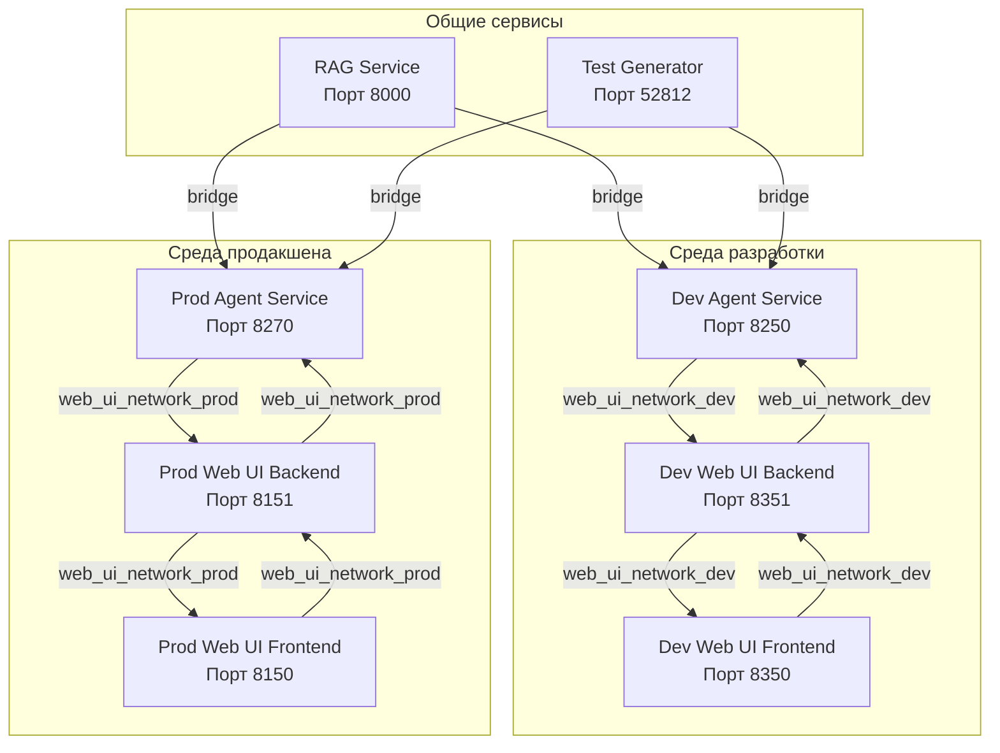

# Документация по сетевому взаимодействию

Этот документ описывает сетевое взаимодействие между сервисом агента и веб-интерфейсом в средах разработки и продакшена.

## Обзор

Система состоит из двух основных сервисов:
- **Сервис агента**: Обрабатывает логику и взаимодействия, связанные с агентом.
- **Веб-интерфейс**: Предоставляет пользовательский интерфейс для взаимодействия с агентом.

Оба сервиса имеют отдельные конфигурации для сред разработки и продакшена, использующие изолированные Docker сети.

## Диаграмма сети



## Среда разработки

### Dev Agent Service
- **Порт**: 8250
- **Имя сервиса**: `agent_dev`
- **Сеть**: `web_ui_network_dev`
- **Конфигурация**: `app_settings-dev.json`
- **URL Web UI**: `http://web_ui_service-frontend-dev:80`

### Dev Web UI Backend
- **Порт**: 8351
- **Имя сервиса**: `web_ui_service-backend-dev`
- **Сеть**: `web_ui_network_dev`
- **URL Agent Service**: `http://agent_dev:8250`
- **Особенности**: Код монтируется через volume, hot reload

### Dev Web UI Frontend
- **Порт**: 8350 (доступен с хоста)
- **Имя сервиса**: `web_ui_service-frontend-dev`
- **Сеть**: `web_ui_network_dev`
- **URL Backend**: `http://web_ui_service-backend-dev:8351`
- **Особенности**: Код монтируется через volume, nginx внутри контейнера

### Взаимодействие
- Сервис агента в среде разработки взаимодействует с Web UI Backend через сеть `web_ui_network_dev`.
- Web UI Backend взаимодействует с Agent Service на порту 8250.
- Web UI Frontend взаимодействует с Web UI Backend на порту 8351.
- Пользователь обращается к Frontend на порту 8350.

## Среда продакшена

### Prod Agent Service
- **Порт**: 8270
- **Имя сервиса**: `agent_prod`
- **Сеть**: `web_ui_network_prod`
- **Конфигурация**: `app_settings-prod.json`
- **URL Web UI**: `http://web_ui_frontend:80`

### Prod Web UI Backend
- **Порт**: 8151
- **Имя сервиса**: `web_ui_backend`
- **Сеть**: `web_ui_network_prod`
- **URL Agent Service**: `http://agent_prod:8250`
- **Особенности**: Готовый Docker образ из GHCR, код внутри образа
- **Образ**: `ghcr.io/lifelong-learning-assisttant/web_ui_backend:v001`

### Prod Web UI Frontend
- **Порт**: 8150 (доступен с хоста)
- **Имя сервиса**: `web_ui_frontend`
- **Сеть**: `web_ui_network_prod`
- **URL Backend**: `http://web_ui_backend:8151`
- **Особенности**: Готовый Docker образ из GHCR, nginx внутри контейнера
- **Образ**: `ghcr.io/lifelong-learning-assisttant/web_ui_frontend:v001`

### Взаимодействие
- Сервис агента в среде продакшена взаимодействует с Web UI Backend через сеть `web_ui_network_prod`.
- Web UI Backend взаимодействует с Agent Service на порту 8250.
- Web UI Frontend взаимодействует с Web UI Backend на порту 8151.
- Пользователь обращается к Frontend на порту 8150.
- Оба сервиса находятся в сети `web_ui_network_prod`, что обеспечивает их изоляцию и корректное взаимодействие.

## Общие сервисы

Оба сервиса агента (dev и prod) взаимодействуют со следующими общими сервисами через сети Docker:

### RAG Service
- **Порт**: 8000
- **URL**: `http://rag-api:8000`
- **Сеть**: `rag_rag_network`
- **Используется для**: Retrieval-Augmented Generation

### Test Generator Service
- **Порт**: 52812
- **URL**: `http://api:52812` (в сети `test_generator_default`)
- **Сеть**: `test_generator_default`
- **Контейнер**: `llm-tester-api`
- **Используется для**: Генерация тестов и их оценка через async-инструменты

## Примечание о сетях

Dev и prod сервисы используют разные сети (`web_ui_network_dev` и `web_ui_network_prod` соответственно) для обеспечения изоляции и предотвращения конфликтов. Это позволяет:
- Избегать случайного взаимодействия между dev и prod сервисами.
- Обеспечивать предсказуемое разрешение имен сервисов внутри каждой сети.
- Упрощать управление и отладку, так как каждая среда изолирована.

## Порядок запуска сервисов

### Для Production
При запуске prod-сервисов важно соблюдать порядок:
1. **Сначала запустите `web_ui_service`**:
    ```bash
    cd web_ui_service
    docker compose -f docker-compose-prod.yml up -d
    ```
    Это создаст сеть `web_ui_network_prod`.

2. **Затем запустите `agent_service`**:
    ```bash
    cd agent_service
    docker compose -f docker-compose-prod.yml up -d
    ```
    Это подключит сервис агента к уже созданной сети `web_ui_network_prod`.

**Важно**: Для production используются готовые образы из GHCR. Убедитесь, что они доступны:
- `ghcr.io/lifelong-learning-assisttant/web_ui_backend:v001`
- `ghcr.io/lifelong-learning-assisttant/web_ui_frontend:v001`
- `ghcr.io/lifelong-learning-assisttant/agent_service:v001`

### Для Development
Для dev режима порядок не критичен, но рекомендуется:
1. **Сначала запустите `web_ui_service`**:
    ```bash
    cd web_ui_service
    docker compose -f docker-compose-dev.yml up --build -d
    ```

2. **Затем запустите `agent_service`**:
    ```bash
    cd agent_service
    docker compose -f docker-compose-dev.yml up --build -d
    ```

**Особенности dev режима**:
- Код монтируется через volume (hot reload)
- Frontend доступен на порту 8350
- Backend доступен на порту 8351
- Agent доступен на порту 8250

Этот порядок важен, так как `web_ui_service` создает сеть, к которой затем подключается `agent_service`.

## Настройка async-инструментов

Для работы async-инструментов с test_generator необходимо:

1. **Добавить httpx в зависимости** (уже в `pyproject.toml`):
   ```toml
   dependencies = [
       "httpx",
       ...
   ]
   ```

2. **Настроить переменные окружения**:
   - `TEST_GENERATOR_SERVICE_URL=http://api:52812`

3. **Обновить docker-compose файлы**:
   - Добавить сеть `test_generator_network` с внешней сетью `test_generator_default`
   - Убедиться, что контейнер agent_service подключен к этой сети

4. **Синхронизировать зависимости в контейнере**:
   ```bash
   docker exec agent_service-agent_dev-1 uv sync
   ```

## Итоги

- **Среда разработки**:
  - Агент: порт 8250
  - Web UI Backend: порт 8351
  - Web UI Frontend: порт 8350 (доступен с хоста)
  - Сеть: `web_ui_network_dev`
  - Код: монтируется через volume (hot reload)

- **Среда продакшена**:
  - Агент: порт 8270
  - Web UI Backend: порт 8151
  - Web UI Frontend: порт 8150 (доступен с хоста)
  - Сеть: `web_ui_network_prod`
  - Код: внутри Docker образов из GHCR

- **Общие сервисы**: Все сервисы используют те же порты для взаимодействия с RAG и Test Generator
- **Изоляция**: Разные сети для dev и prod предотвращают конфликты
- **Async-инструменты**: Работают через httpx с test_generator по адресу `http://api:52812` в сети `test_generator_default`

Эта конфигурация обеспечивает возможность одновременной работы обеих сред без конфликтов портов, сохраняя при этом согласованное взаимодействие с общими сервисами.