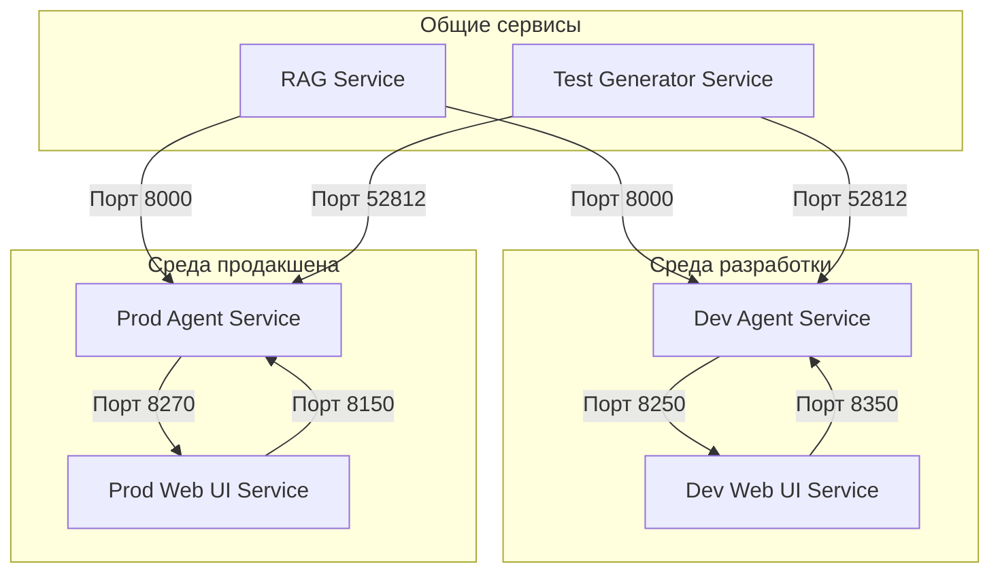

# Документация по сетевому взаимодействию

Этот документ описывает сетевое взаимодействие между сервисом агента и веб-интерфейсом в средах разработки и продакшена.

## Обзор

Система состоит из двух основных сервисов:
- **Сервис агента**: Обрабатывает логику и взаимодействия, связанные с агентом.
- **Веб-интерфейс**: Предоставляет пользовательский интерфейс для взаимодействия с агентом.

Оба сервиса имеют отдельные конфигурации для сред разработки и продакшена.

## Диаграмма сети

## Среда разработки

### Dev Agent Service
- **Порт**: 8250
- **Имя сервиса**: `agent_dev`
- **Конфигурация**: `app_settings-dev.json`
- **URL Web UI**: `http://web_ui_dev:8350`

### Dev Web UI Service
- **Порт**: 8350
- **Имя сервиса**: `web_ui_dev`
- **URL Agent Service**: `http://agent_service:8250`

### Взаимодействие
- Сервис агента в среде разработки взаимодействует с веб-интерфейсом на порту 8350.
- Веб-интерфейс в среде разработки взаимодействует с сервисом агента на порту 8250.

## Среда продакшена

### Prod Agent Service
- **Порт**: 8270
- **Имя сервиса**: `agent_prod`
- **Конфигурация**: `app_settings-prod.json`
- **URL Web UI**: `http://web_ui_prod:8150`

### Prod Web UI Service
- **Порт**: 8150
- **Имя сервиса**: `web_ui_prod`
- **URL Agent Service**: `http://agent_service:8270`

### Взаимодействие
- Сервис агента в среде продакшена взаимодействует с веб-интерфейсом на порту 8150.
- Веб-интерфейс в среде продакшена взаимодействует с сервисом агента на порту 8270.

## Общие сервисы

Оба сервиса агента (dev и prod) взаимодействуют со следующими общими сервисами:

- **RAG Service**: Порт 8000
- **Test Generator Service**: Порт 52812

## Итоги

- **Среда разработки**: Агент на порту 8250, Веб-интерфейс на порту 8350
- **Среда продакшена**: Агент на порту 8270, Веб-интерфейс на порту 8150
- **Общие сервисы**: Все сервисы используют те же порты для взаимодействия с сервисами RAG и test generator.

Эта конфигурация обеспечивает возможность одновременной работы обеих сред без конфликтов портов, сохраняя при этом согласованное взаимодействие с общими сервисами.