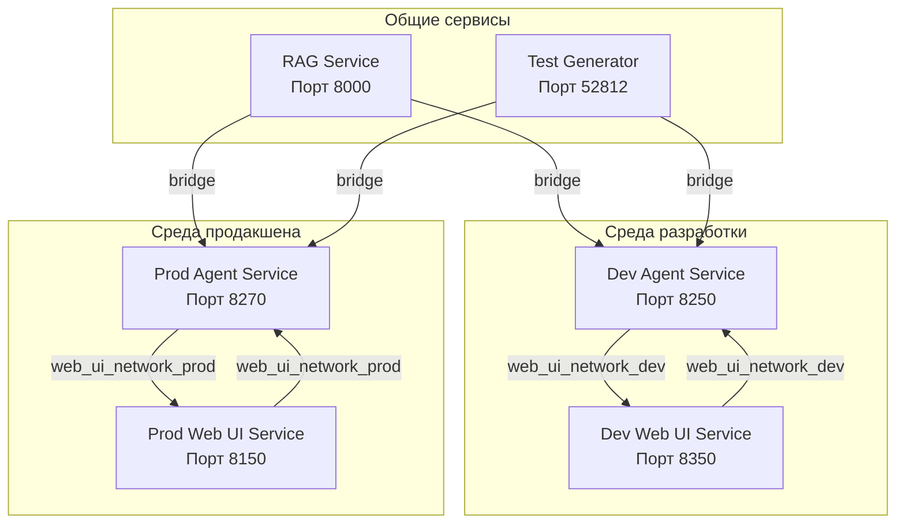

# Документация по сетевому взаимодействию

Этот документ описывает сетевое взаимодействие между сервисом агента и веб-интерфейсом в средах разработки и продакшена.

## Обзор

Система состоит из двух основных сервисов:
- **Сервис агента**: Обрабатывает логику и взаимодействия, связанные с агентом.
- **Веб-интерфейс**: Предоставляет пользовательский интерфейс для взаимодействия с агентом.

Оба сервиса имеют отдельные конфигурации для сред разработки и продакшена, использующие изолированные Docker сети.

## Диаграмма сети



## Среда разработки

### Dev Agent Service
- **Порт**: 8250
- **Имя сервиса**: `agent_dev`
- **Сеть**: `web_ui_network_dev`
- **Конфигурация**: `app_settings-dev.json`
- **URL Web UI**: `http://web_ui_dev:8350`

### Dev Web UI Service
- **Порт**: 8350
- **Имя сервиса**: `web_ui_dev`
- **Сеть**: `web_ui_network_dev`
- **URL Agent Service**: `http://agent_dev:8250`

### Взаимодействие
- Сервис агента в среде разработки взаимодействует с веб-интерфейсом через сеть `web_ui_network_dev`.
- Веб-интерфейс в среде разработки взаимодействует с сервисом агента на порту 8250.

## Среда продакшена

### Prod Agent Service
- **Порт**: 8270
- **Имя сервиса**: `agent_prod`
- **Сеть**: `web_ui_network_prod`
- **Конфигурация**: `app_settings-prod.json`
- **URL Web UI**: `http://web_ui_prod:8150`

### Prod Web UI Service
- **Порт**: 8150
- **Имя сервиса**: `web_ui_prod`
- **Сеть**: `web_ui_network_prod`
- **URL Agent Service**: `http://agent_prod:8270`

### Взаимодействие
- Сервис агента в среде продакшена взаимодействует с веб-интерфейсом через сеть `web_ui_network_prod`.
- Веб-интерфейс в среде продакшена взаимодействует с сервисом агента на порту 8270.
- Оба сервиса находятся в сети `web_ui_network_prod`, что обеспечивает их изоляцию и корректное взаимодействие.

## Общие сервисы

Оба сервиса агента (dev и prod) взаимодействуют со следующими общими сервисами через сеть `bridge`:

- **RAG Service**: Порт 8000
  - URL: `http://rag-api:8000`
  - Используется для Retrieval-Augmented Generation

- **Test Generator Service**: Порт 52812
  - URL: `http://test_generator:52812`
  - Используется для генерации тестов

## Примечание о сетях

Dev и prod сервисы используют разные сети (`web_ui_network_dev` и `web_ui_network_prod` соответственно) для обеспечения изоляции и предотвращения конфликтов. Это позволяет:
- Избегать случайного взаимодействия между dev и prod сервисами.
- Обеспечивать предсказуемое разрешение имен сервисов внутри каждой сети.
- Упрощать управление и отладку, так как каждая среда изолирована.

## Порядок запуска сервисов

### Для Production
При запуске prod-сервисов важно соблюдать порядок:
1. **Сначала запустите `web_ui_service`**:
   ```bash
   cd web_ui_service
   docker compose -f docker-compose-prod.yml up -d
   ```
   Это создаст сеть `web_ui_network_prod`.

2. **Затем запустите `agent_service`**:
   ```bash
   cd agent_service
   docker compose -f docker-compose-prod.yml up -d
   ```
   Это подключит сервис агента к уже созданной сети `web_ui_network_prod`.

### Для Development
Для dev режима порядок не критичен, но рекомендуется:
1. **Сначала запустите `web_ui_service`**:
   ```bash
   cd web_ui_service
   docker compose -f docker-compose-dev.yml up -d
   ```

2. **Затем запустите `agent_service`**:
   ```bash
   cd agent_service
   docker compose -f docker-compose-dev.yml up --build -d
   ```

Этот порядок важен, так как `web_ui_service` создает сеть, к которой затем подключается `agent_service`.

## Итоги

- **Среда разработки**: Агент на порту 8250, Веб-интерфейс на порту 8350, сеть `web_ui_network_dev`
- **Среда продакшена**: Агент на порту 8270, Веб-интерфейс на порту 8150, сеть `web_ui_network_prod`
- **Общие сервисы**: Все сервисы используют те же порты для взаимодействия с RAG и Test Generator
- **Изоляция**: Разные сети для dev и prod предотвращают конфликты

Эта конфигурация обеспечивает возможность одновременной работы обеих сред без конфликтов портов, сохраняя при этом согласованное взаимодействие с общими сервисами.