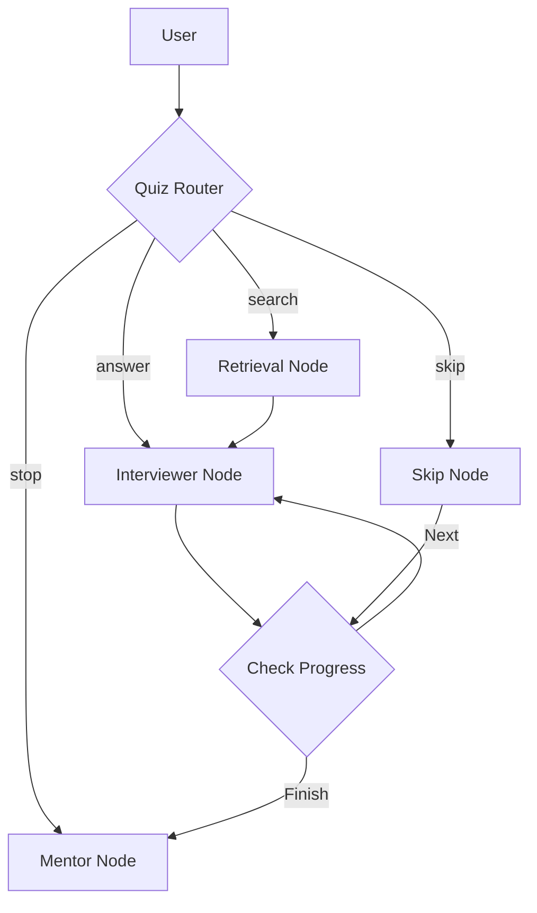

# Архитектура Квиз-Агента: Анализ и Рекомендации (2026)

На основе анализа текущей реализации (`Quiz Subgraph`) и современных паттернов проектирования AI-агентов (2025-2026), предлагается следующий обзор архитектуры.

## 1. Текущая Архитектура (As-Is)

Граф квиза реализован как конечный автомат (FSM) с явным маршрутизатором:

### Проблемы текущей реализации:
1.  **Конфликт интентов**: Роутер (`QuizRouter`) пытается классифицировать сложные запросы (например, "Что такое трансформер?") как `quiz_answering` из-за сильного смещения контекста в сторону квиза. Это типичная проблема "Over-fitting to Context" в FSM.
2.  **Жесткая связность**: Логика перехода `Retrieval -> Interviewer` неявная и зависит от наличия документов в состоянии, что усложняет тестирование и отладку.
3.  **Отсутствие "Chartering"**: Агент жестко следует графу, не имея возможности динамически перестроить план обучения, если пользователь демонстрирует пробелы в знаниях (адаптивность).

## 2. Лучшие практики 2026 (Deep Research)

Согласно последним исследованиям (Rakesh Gohel, Sebastian Raschka, Justin Grammens), актуальны следующие паттерны:

### A. State Machines + LLM (Agentic Chartering)
Вместо жесткого графа, LLM может генерировать или модифицировать карту состояний на лету.
*   **Применимость**: В квизе это означает, что если пользователь "плавает" в теме, агент может создать ветку "Remedial Lesson" (урок-коррекция) динамически, а не просто идти к следующему вопросу.

### B. Prompt + Policy Separation
Четкое разделение промптов (инструкций) и политик (правил бизнеса).
*   **Применимость**: Вынос логики "когда можно давать подсказку" из промпта интервьюера в отдельный слой валидации (Policy Layer).

### C. Agent + Tool Orchestration
Использование агентов только там, где нужно рассуждение. Простые переходы (next question) должны быть детерминированными.
*   **Применимость**: `CheckProgress` — это правильный паттерн (детерминированный узел). Но `QuizRouter` перегружен.

## 3. Предлагаемые изменения (To-Be)

Для решения проблемы с тестом `test_rag_search_flow_integration` и улучшения архитектуры:

### Вариант 1: "Explicit Escape Hatch" (Быстрое решение)
Добавить явный "люк" в роутере для технических вопросов.
*   **Реализация**: Усилить промпт `quiz_router.txt`, явно указав, что любой вопрос "Что такое X?" или "Как работает Y?" — это `search`, даже если он пересекается с темой квиза.
*   **Плюсы**: Минимальные изменения кода.
*   **Минусы**: Не решает фундаментальную проблему двусмысленности.

### Вариант 2: "Dual-Pass Routing" (Надежное решение)
Разделить классификацию на два этапа:
1.  **Structural Check**: Это команда управления (`/skip`, `/stop`) или ответ? (Быстрая модель/RegEx).
2.  **Semantic Check**: Если это текст, относится ли он к *содержанию* текущего вопроса (ответ) или к *предметной области* вообще (вопрос)?
    *   Сравнить эмбеддинг ответа пользователя с эмбеддингом вопроса и правильного ответа. Если similarity низкий, но высок с темами ML -> это `search`.

### Вариант 3: "Interviewer-First" (Архитектурное упрощение)
Убрать `QuizRouter` как отдельный LLM-узел перед каждым шагом.
Сделать `Interviewer` главным узлом, который сам решает: принять ответ, ответить на вопрос (через вызов tool) или пропустить.
*   **Плюсы**: Естественный диалог. LLM сама видит контекст.
*   **Минусы**: Сложный промпт Интервьюера, риск галлюцинаций.

## 4. Рекомендация для текущей задачи

Для текущего этапа (Stage 3) и исправления теста рекомендуется **Вариант 1 (Усиление промпта)** с элементами **Варианта 2 (Приоритет команд)**.

**План действий:**
1.  Модифицировать `agent_service/prompts/quiz_router.txt`: Добавить few-shot примеры, где технические вопросы классифицируются как `search`.
2.  В `quiz_router_node` добавить эвристику: если текст заканчивается на `?` и длиннее 3 слов -> повысить вероятность `search` или `help`.

## 5. Схема тестов (Coverage Plan Update)

Тесты должны покрывать не только узлы, но и переходы (Edges):
1.  **Router Edge Cases**:
    *   Ответ, похожий на вопрос ("А это разве не градиент?").
    *   Вопрос, похожий на ответ ("Вектор градиента").
2.  **State Persistence**:
    *   Проверка, что `current_quiz_index` не сбрасывается при уходе в `search`.
3.  **Idempotency**:
    *   Повторная отправка того же ответа не должна ломать состояние.