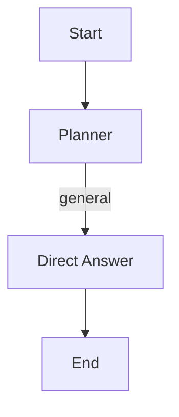
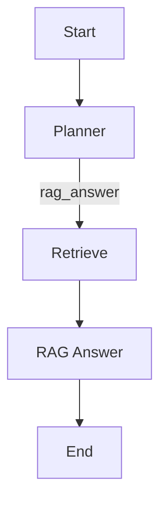
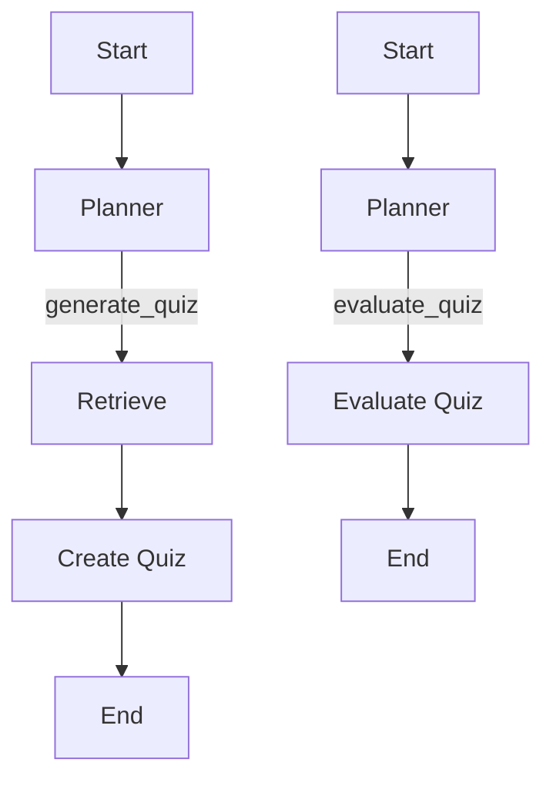

# Документация по тестам

## Обзор

Тесты для агента покрывают различные сценарии использования, включая простые разговоры, работу с RAG и генерацию/оценку квизов. Тесты организованы в виде пайплайнов, которые проверяют корректность работы агента в различных сценариях.

## Структура тестов

### Тесты пайплайнов

Тесты организованы в виде пайплайнов, которые проверяют корректность работы агента в различных сценариях:

1. **`test_chitchat_pipeline.py`**: Тестирует пайплайн простого общения.
2. **`test_rag_pipeline.py`**: Тестирует пайплайн работы с RAG.
3. **`test_quiz_pipeline.py`**: Тестирует пайплайн работы с квизами.

### Сценарии тестирования

#### Простой разговор



#### Работа с RAG



#### Генерация и оценка квиза



## Примеры тестов

### Тест простого общения

```python
def test_chitchat_pipeline():
    """Тестируем пайплайн простого общения"""
    print("=== Testing Chitchat Pipeline ===")
    
    # Создаем агент
    agent = AgentSystem()
    
    # Тест с простым вопросом
    print("\n--- Testing Simple Question ---")
    try:
        result = agent.run("Привет! Как дела?", session_id="chitchat_session")
        print(f"Agent response: {result[:300]}...")
        assert len(result) > 0, "Ответ не должен быть пустым"
    except Exception as e:
        print(f"Agent error: {e}")
        raise
    
    # Тест с общим вопросом
    print("\n--- Testing General Question ---")
    try:
        result = agent.run("Расскажи о себе", session_id="chitchat_session")
        print(f"Agent response: {result[:300]}...")
        assert len(result) > 0, "Ответ не должен быть пустым"
    except Exception as e:
        print(f"Agent error: {e}")
        raise
    
    # Тест с вопросом о погоде
    print("\n--- Testing Weather Question ---")
    try:
        result = agent.run("Какая сегодня погода?", session_id="chitchat_session")
        print(f"Agent response: {result[:300]}...")
        assert len(result) > 0, "Ответ не должен быть пустым"
    except Exception as e:
        print(f"Agent error: {e}")
        raise
```

### Тест работы с RAG

```python
def test_rag_pipeline():
    """Тестируем пайплайн работы с RAG"""
    print("=== Testing RAG Pipeline ===")
    
    # Создаем агент
    agent = AgentSystem()
    
    # Тест с вопросом, требующим поиска в RAG
    print("\n--- Testing RAG Search Question ---")
    try:
        result = agent.run("Расскажи о машинном обучении из учебника Яндекса", session_id="rag_session")
        print(f"Agent response: {result[:300]}...")
        assert len(result) > 0, "Ответ не должен быть пустым"
    except Exception as e:
        print(f"Agent error: {e}")
        raise
    
    # Тест с вопросом, требующим генерации ответа на основе RAG
    print("\n--- Testing RAG Generate Question ---")
    try:
        result = agent.run("Сгенерируй ответ о нейронных сетях на основе учебника Яндекса", session_id="rag_session")
        print(f"Agent response: {result[:300]}...")
        assert len(result) > 0, "Ответ не должен быть пустым"
    except Exception as e:
        print(f"Agent error: {e}")
        raise
    
    # Тест с вопросом, требующим поиска и генерации
    print("\n--- Testing RAG Search and Generate Question ---")
    try:
        result = agent.run("Найди информацию о глубоком обучении и сгенерируй ответ", session_id="rag_session")
        print(f"Agent response: {result[:300]}...")
        assert len(result) > 0, "Ответ не должен быть пустым"
    except Exception as e:
        print(f"Agent error: {e}")
        raise
```

### Тест работы с квизами

```python
def test_quiz_pipeline():
    """Тестируем пайплайн работы с квизами"""
    print("=== Testing Quiz Pipeline ===")
    
    # Создаем агент
    agent = AgentSystem()
    
    # Тест с генерацией квиза
    print("\n--- Testing Quiz Generation ---")
    try:
        result = agent.run("Создай квиз по машинному обучению из учебника Яндекса", session_id="quiz_session")
        print(f"Generated quiz: {result[:300]}...")
        assert len(result) > 0, "Ответ не должен быть пустым"
    except Exception as e:
        print(f"Agent error: {e}")
        raise
    
    # Тест с оценкой квиза
    print("\n--- Testing Quiz Evaluation ---")
    try:
        # Предполагаем, что квиз уже сгенерирован в предыдущем шаге
        result = agent.run("Вот мои ответы на квиз: ответ 1, ответ 2", session_id="quiz_session")
        print(f"Evaluation result: {result[:300]}...")
        assert len(result) > 0, "Ответ не должен быть пустым"
    except Exception as e:
        print(f"Agent error: {e}")
        raise
    
    # Тест с полным циклом: генерация квиза и оценка
    print("\n--- Testing Full Quiz Cycle ---")
    try:
        # Генерируем квиз
        quiz_result = agent.run("Создай квиз по глубокому обучению", session_id="full_quiz_session")
        print(f"Generated quiz: {quiz_result[:200]}...")
        assert len(quiz_result) > 0, "Ответ не должен быть пустым"
        
        # Оцениваем ответ
        evaluation_result = agent.run("Вот мои ответы на квиз: ответ 1, ответ 2", session_id="full_quiz_session")
        print(f"Evaluation result: {evaluation_result[:200]}...")
        assert len(evaluation_result) > 0, "Ответ не должен быть пустым"
    except Exception as e:
        print(f"Agent error: {e}")
        raise
```

## Заключение

Тесты покрывают различные сценарии использования агента, включая простые разговоры, работу с RAG и генерацию/оценку квизов. Использование памяти позволяет реализовывать сложные сценарии, такие как генерация квиза и последующая оценка ответов пользователя.