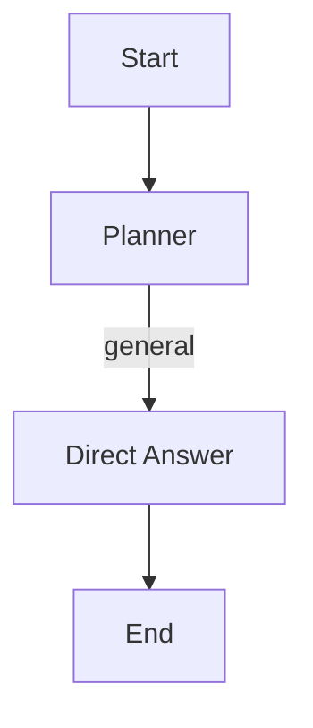
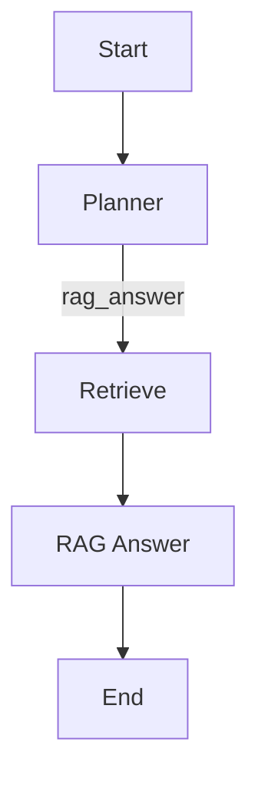
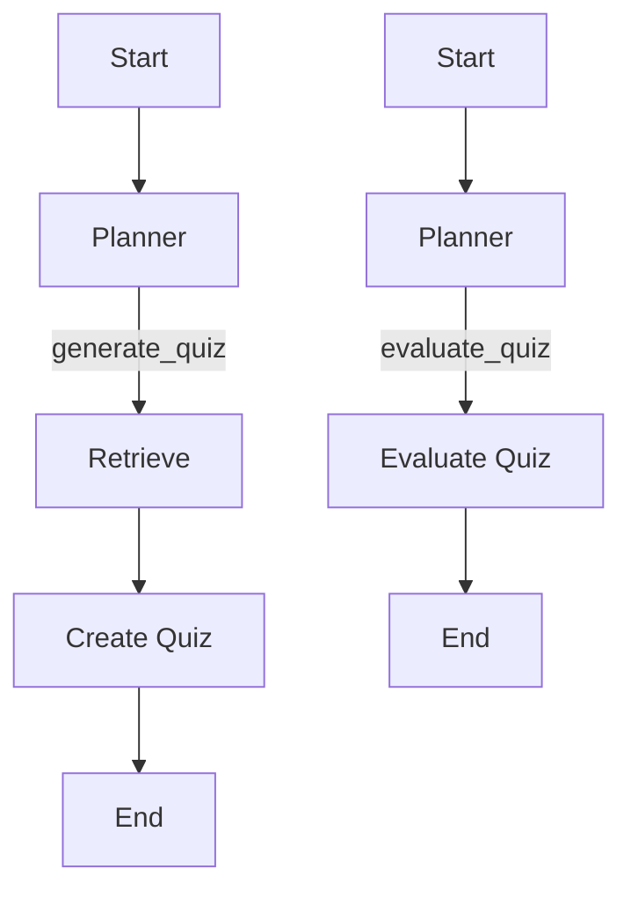

# Документация по тестам

## Обзор

Тесты для агента покрывают различные сценарии использования, включая простые разговоры, работу с RAG и генерацию/оценку квизов. Тесты организованы в виде пайплайнов, которые проверяют корректность работы агента в различных сценариях.

## Структура тестов

### Тесты пайплайнов

Тесты организованы в виде пайплайнов, которые проверяют корректность работы агента в различных сценариях:

1. **`test_chitchat_pipeline.py`**: Тестирует пайплайн простого общения.
2. **`test_rag_pipeline.py`**: Тестирует пайплайн работы с RAG.
3. **`test_quiz_pipeline.py`**: Тестирует пайплайн работы с квизами.

### Сценарии тестирования

#### Простой разговор

#### Работа с RAG

#### Генерация и оценка квиза

## Примеры тестов

Примеры тестов доступны в соответствующих тестовых скриптах:

- [Тест простого общения](agent_service/tests/pipeline/test_chitchat_pipeline.py)
- [Тест работы с RAG](agent_service/tests/pipeline/test_rag_pipeline.py)
- [Тест работы с квизами](agent_service/tests/pipeline/test_quiz_pipeline.py)

## Заключение

Тесты покрывают различные сценарии использования агента, включая простые разговоры, работу с RAG и генерацию/оценку квизов. Использование памяти позволяет реализовывать сложные сценарии, такие как генерация квиза и последующая оценка ответов пользователя.

Для более подробной информации об архитектуре и функциональности агента, см. [Документация по агенту](agent_documentation.md).