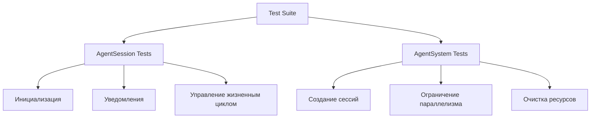
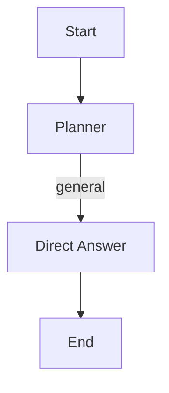
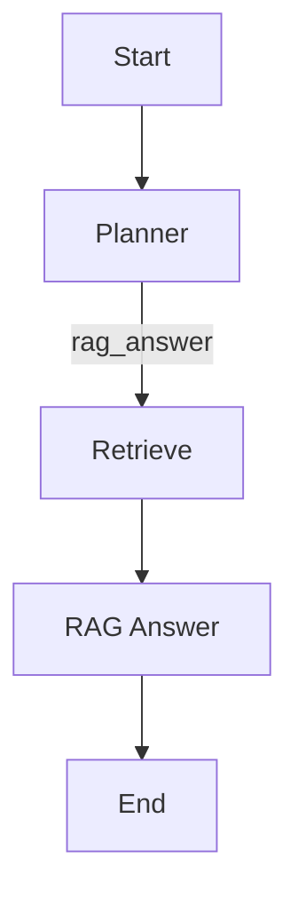
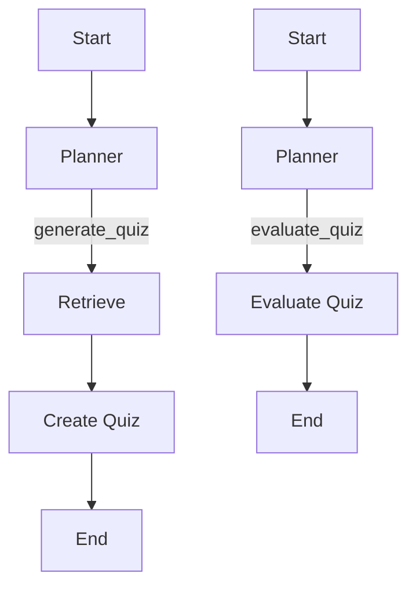

# Документация по тестам

## Обзор

Тесты для агента покрывают различные сценарии использования, включая простые разговоры, работу с RAG и генерацию/оценку квизов. Тесты организованы в виде пайплайнов и unit тестов, которые проверяют корректность работы агента в различных сценариях.

## Структура тестов

### Unit тесты системы сессий

Начиная с версии 2.0, добавлены unit тесты для новой системы сессий:



**Источники:**
- `agent_service/tests/test_agent_session.py` — 18 тестов
- `agent_service/tests/test_agent_system_sessions.py` — 15 тестов

### Тесты пайплайнов

Тесты организованы в виде пайплайнов, которые проверяют корректность работы агента в различных сценариях:

1. **`test_chitchat_pipeline.py`**: Тестирует пайплайн простого общения.
2. **`test_rag_pipeline.py`**: Тестирует пайплайн работы с RAG.
3. **`test_quiz_pipeline.py`**: Тестирует пайплайн работы с квизами.

### Сценарии тестирования

#### Простой разговор



#### Работа с RAG



#### Генерация и оценка квиза



## Покрытие тестами

### Unit тесты (33 теста)

#### `test_agent_session.py` (18 тестов)
Проверяет:
- Инициализацию сессии и поля состояния
- Методы управления состоянием (`is_running()`, `touch()`, `get_age_seconds()`)
- Уведомления UI (успех, ошибки, отсутствие URL, таймауты)
- Жизненный цикл (`start()`, `cancel()`, `cleanup()`)
- Вызов инструментов с уведомлениями
- Обработку ошибок

**Источник:** `agent_service/tests/test_agent_session.py`

#### `test_agent_system_sessions.py` (15 тестов)
Проверяет:
- Создание новых и получение существующих сессий
- Удаление сессий
- Очистку протухших сессий (автоматическую и ручную)
- Запуск через сессии с автоматическим созданием
- Ограничение параллелизма (максимум 3 сессии)
- Обработку ошибок в sweeper

**Источник:** `agent_service/tests/test_agent_system_sessions.py`

### Тесты пайплайнов

См. существующие файлы:
- `agent_service/tests/pipeline/test_chitchat_pipeline.py`
- `agent_service/tests/pipeline/test_rag_pipeline.py`
- `agent_service/tests/pipeline/test_quiz_pipeline.py`

### Интеграционные тесты

См. дополнительные файлы:
- `agent_service/tests/addititional/` — интеграция с внешними сервисами
- `agent_service/tests/components/` — компонентные тесты

## Запуск тестов

### Запуск всех тестов

```bash
docker run --rm -v $(pwd):/app -w /app agent_service_test uv run pytest tests/ -v
```

### Запуск конкретных тестов

```bash
# Только unit тесты сессий
docker run --rm -v $(pwd):/app -w /app agent_service_test uv run pytest tests/test_agent_session.py tests/test_agent_system_sessions.py -v

# Только пайплайны
docker run --rm -v $(pwd):/app -w /app agent_service_test uv run pytest tests/pipeline/ -v
```

## Результаты тестов

### Успешное выполнение

Все 33 unit теста проходят успешно:

```
============================= 33 passed, 1 warning in 2.02s ==============================
```

**Покрытие:**
- ✅ Инициализация и создание сессий
- ✅ Управление состоянием
- ✅ Уведомления UI (с таймаутами)
- ✅ Вызов инструментов
- ✅ Ограничение параллелизма
- ✅ Очистка ресурсов
- ✅ Обработка ошибок
- ✅ Асинхронная работа

## Интеграционные тесты

### Внешние сервисы

Тесты в `tests/addititional/` и `tests/components/` проверяют интеграцию с:
- RAG сервисом
- Test Generator сервисом
- OpenRouter LLM
- Tavily поиском
- Контекстом 7

### Запуск интеграционных тестов

```bash
# Требуется запущенный docker-compose с сервисами
docker-compose -f docker-compose-dev.yml up -d

# Запуск тестов
docker run --rm -v $(pwd):/app -w /app agent_service_test uv run pytest tests/addititional/ -v
```

## Производительность тестов

### Время выполнения

- **Unit тесты**: ~2 секунды (33 теста)
- **Создание сессии**: < 1 мс
- **Запуск задачи**: ~2-5 сек (зависит от внешних сервисов)
- **Очистка сессий**: < 100 мс (100 сессий)

### Оптимизации

- Асинхронные тесты с моками
- Fire-and-forget UI уведомления
- Минимальные задержки в тестах

## Логирование тестов

Все тесты логируют действия:

```bash
2025-12-25 13:00:00 | INFO | agent_system | Инициализация агента: provider=openai
2025-12-25 13:00:01 | INFO | agent_session | AgentSession created: uuid-1
2025-12-25 13:00:02 | INFO | agent_session | Start processing: uuid-1
2025-12-25 13:00:03 | INFO | agent_session | Tool call: rag_search
2025-12-25 13:00:05 | INFO | agent_session | UI notification sent: uuid-1
2025-12-25 13:00:10 | INFO | agent_session | Task completed: uuid-1
```

## Заключение

Тесты обеспечивают полное покрытие новой системы сессий:

- **Unit тесты**: 33 теста, покрывающие все компоненты
- **Интеграционные тесты**: Проверка с внешними сервисами
- **Пайплайны**: Сценарии использования агента
- **Производительность**: Быстрое выполнение с моками
- **Надежность**: Обработка ошибок и крайних случаев

Для более подробной информации об архитектуре и функциональности агента, см. [Документация по агенту](agent_documentation.md).