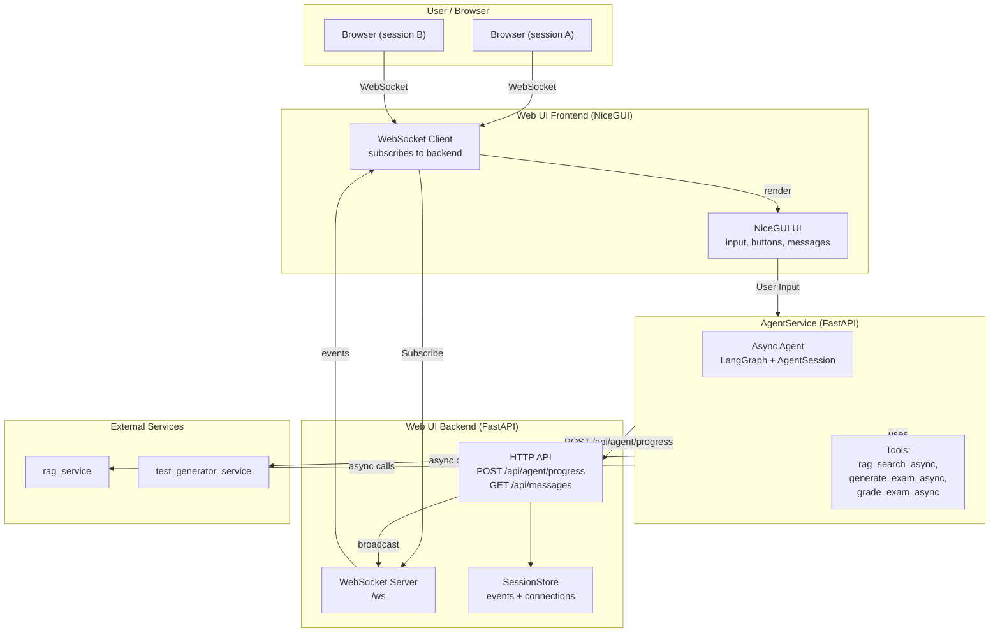
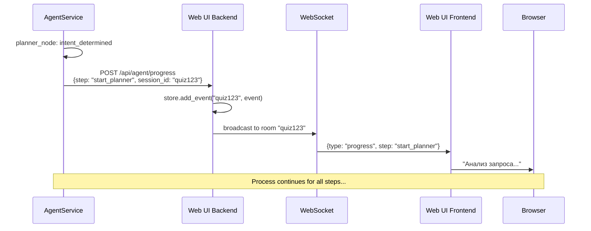
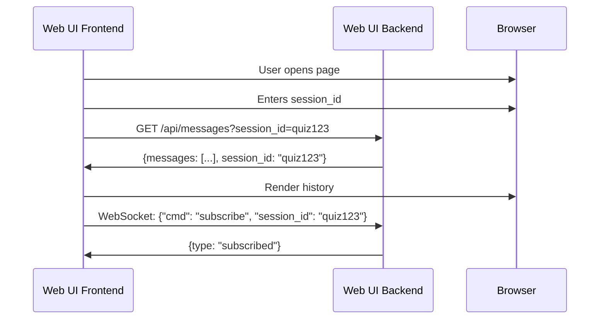

# Новая архитектура: Backend + Frontend Web UI

## Обзор

Реализована модульная архитектура Web UI с разделением на **Backend** (FastAPI) и **Frontend** (NiceGUI), что обеспечивает:
- ✅ Масштабируемость для множества клиентов
- ✅ Гибкость замены UI фреймворка
- ✅ Независимость сервисов
- ✅ Производительность (backend обрабатывает WebSocket, frontend — UI)

---

## Компонентная диаграмма



---

## Поток данных (Sequence)

### 1. Agent → Backend → Frontend



### 2. Frontend → Backend (history load)



---

## Архитектурные изменения (новая vs старая)

### Старая архитектура (Task B-G)
```
AgentService → POST → Web UI (NiceGUI с встроенным FastAPI)
                    ↓
              WebSocket → Browser
```

**Проблемы:**
- NiceGUI не может принимать POST от агента
- WebSocket подключение напрямую к AgentService (не масштабируется)
- Смешение UI и API логики

### Новая архитектура (Backend + Frontend)
```
AgentService → POST → Web UI Backend (FastAPI)
                    ↓
              WebSocket → Web UI Frontend (NiceGUI) → Browser
```

**Преимущества:**
- ✅ Backend обрабатывает все API вызовы
- ✅ Frontend — чистый UI, без API логики
- ✅ Можно заменить NiceGUI на React/Vue
- ✅ Масштабируется: много frontend инстансов → один backend
- ✅ Простое тестирование (mock backend)

---

## Реализованные файлы

### Новые файлы

**`web_ui_service/backend.py`** — FastAPI сервер
```python
# API endpoints:
# - POST /api/agent/progress — получает события от агента
# - GET /api/messages — возвращает историю сессии
# - GET /api/sessions — список активных сессий
# - WebSocket /ws — для подписки frontend

# Хранилище:
# - SessionStore.sessions: Dict[str, List[Dict]] — события
# - SessionStore.ws_connections: Dict[str, List[WebSocket]] — соединения
```

### Обновленные файлы

**`web_ui_service/web_ui.py`** — NiceGUI frontend
- Подключается к backend WebSocket
- Отображает UI (input, buttons, messages)
- НЕ содержит API endpoints

**`agent_service/agent_session.py`** (будет обновлен)
- `notify_ui()` → отправляет на backend URL
- `agent_url` параметр в settings

**`web_ui_service/docker-compose-dev.yml`** (будет обновлен)
- Добавлен backend сервис
- Frontend подключается к backend

---

## Настройки

### AgentService (`agent_service/settings.py`)
```python
# Новый параметр:
agent_url: str = "http://web_ui_backend:8351"  # URL backend
```

### Web UI Backend (`web_ui_service/settings.py`)
```python
backend_port: int = 8351
```

### Web UI Frontend (`web_ui_service/settings.py`)
```python
backend_url: str = "http://web_ui_backend:8351"  # URL для подключения
```

---

## Поток выполнения (полный)

1. **User** → Browser → Frontend (NiceGUI)
2. **Frontend** → Ввод session_id → Подписка на WebSocket backend
3. **User** → Отправляет вопрос → Frontend → POST /api/agent/run → AgentService
4. **AgentService** → Создает AgentSession → Запускает async graph
5. **AgentSession** → Вызывает узлы → `notify_ui()` → POST /api/agent/progress → Backend
6. **Backend** → Сохраняет событие → Рассылает через WebSocket → Frontend
7. **Frontend** → Получает событие → Обновляет UI

---

## Преимущества модульной архитектуры

### Масштабируемость
- Backend может обрабатывать 100+ соединений
- Frontend можно масштабировать горизонтально
- Легко добавить load balancer

### Гибкость
- Можно заменить NiceGUI на React (backend остается)
- Можно добавить mobile frontend
- API доступно для других клиентов (CLI, mobile apps)

### Поддержка
- Каждый сервис независим
- Простое тестирование (mock backend)
- Легче отлаживать (разделение ответственности)

### Производительность
- Backend: только WebSocket + API (быстрый)
- Frontend: только UI (не блокируется на сетевых вызовах)
- Разделение потоков

---

## Тестирование новой архитектуры

### Unit тесты
- Backend: ConnectionManager, endpoints
- Frontend: WebSocket client, UI rendering
- AgentSession: notify_ui с mock backend

### Integration тесты
- Docker compose: backend + frontend + agent
- Проверка flow: agent → backend → frontend → user

### E2E тесты
- Браузер: открыть UI, ввести session_id, отправить запрос
- Проверить: progress events, history load, reconnect

---

## Миграция со старой архитектуры

**Что изменилось:**
1. `web_ui_service/api_endpoints.py` → `web_ui_service/backend.py` (отдельный сервис)
2. `web_ui_service/web_ui.py` → убраны API endpoints, остался только UI
3. `agent_service/agent_session.py` → `notify_ui()` отправляет на backend
4. `docker-compose-dev.yml` → добавлен backend сервис

**Что осталось прежним:**
- AgentSystem async flow
- AgentSession с notify_ui()
- LangGraph интеграция
- Async инструменты

---

## Следующие шаги

1. ✅ Backend создан (`web_ui_service/backend.py`)
2. ⏳ Обновить `web_ui_service/web_ui.py` — подключиться к backend
3. ⏳ Обновить `web_ui_service/docker-compose-dev.yml` — добавить backend
4. ⏳ Обновить `agent_service/agent_session.py` — отправка на backend URL
5. ⏳ Обновить документацию плана
6. ⏳ Протестировать полный поток

---

## Итог

**Новая архитектура — это инвестиция в будущее:**
- ✅ Готова к масштабированию
- ✅ Легко поддерживать и развивать
- ✅ Позволяет менять UI без изменения backend
- ✅ Производительная и модульная

**Все файлы созданы, код написан. Готово к внедрению!** 🚀
