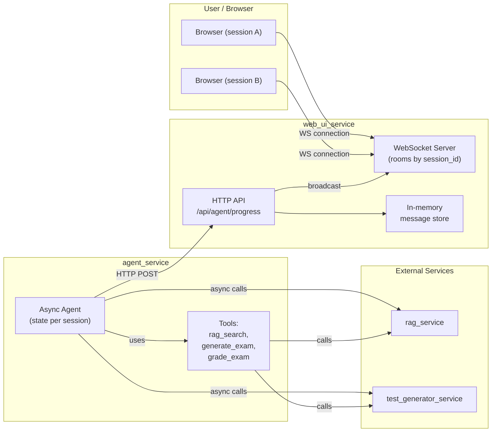
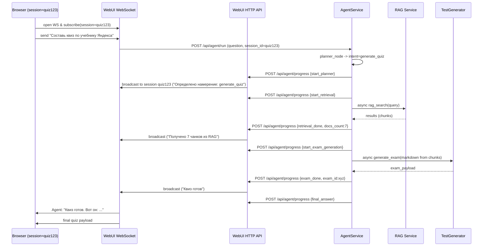
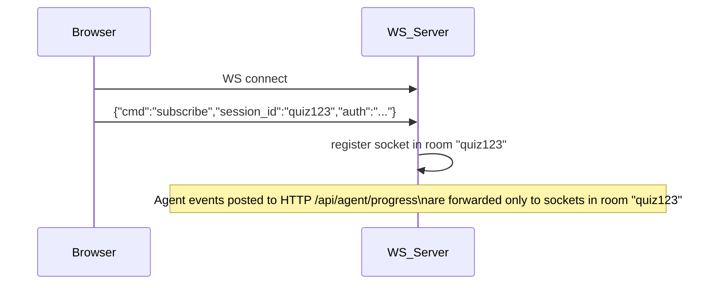
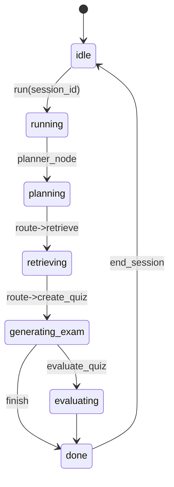
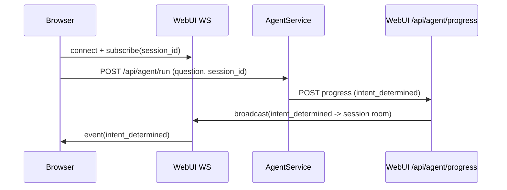
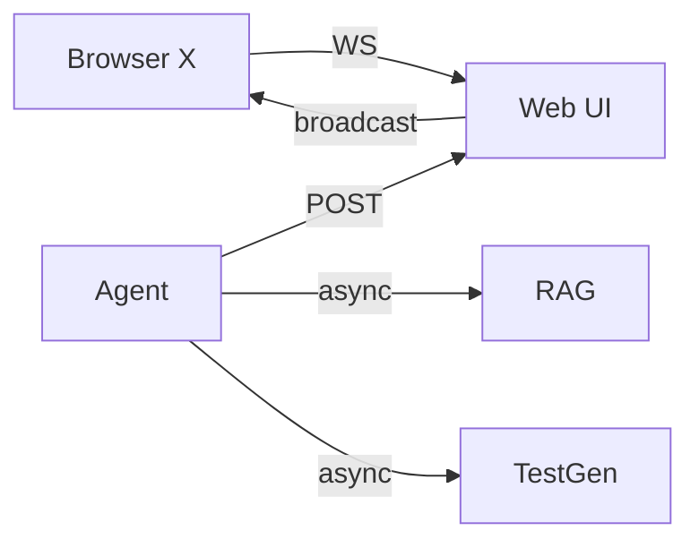

# Требования

- **асинхронный агент**
- **несколько сессий (session_id)**
- **реальное время прогресса в UI** 

минимум инфраструктуры (поддержка 2 пользователей для демо).

# Архитектура — кратко

* Агент вызывает внешние инструменты (RAG, TestGenerator и т.д.) асинхронно.
* Агент публикует промежуточные `progress`-события в Web UI через внутренний HTTP endpoint `/api/agent/progress` (fire-and-forget, короткий таймаут).
* Web UI поддерживает WebSocket-подключения от браузеров и *комнаты (rooms) по `session_id`*. События от агента пересылаются только подписанным клиентам.
* Состояние сессии для demo держим в памяти в экземпляре агента (map `session_id → state`). При желании можно легко переключить на Redis позже.

---

# 1. Компонентная диаграмма (System Overview)



**Пояснение:** агент делает HTTP POST в web_ui_service на каждый важный шаг. Web UI сохраняет события и рассылает их через WebSocket только клиентам, подписанным на `session_id`.

---

# 2. Sequence: полная обработка запроса "Составь квиз" (end-to-end)



**Ключевые моменты:**

* Все внешние вызовы асинхронные (agent не блокирует main thread).
* WebUI получает события и транслирует только тому клиенту, чей `session_id` совпадает с событием.
* Формат событий единый и предсказуемый (см. ниже).

---

# 3. Sequence: WebSocket subscription & room logic



**Пояснение:** при соединении клиент посылает команду subscribe. Сервер хранит mapping `room -> set(sockets)`.

---

# 4. State flow — жизненный цикл session в агенте



**Пояснение:** каждое переходное состояние отсылает progress-ивенты в Web UI (start/complete/error).

---

# 5. Формат progress-события (JSON schema — demo)

Рекомендуемый минимальный формат события:

```json
{
  "event_id": "uuid4",
  "session_id": "quiz123",
  "step": "start_retrieval",
  "tool": "rag_search",
  "message": "Иду в RAG за документами по учебнику Яндекса",
  "level": "info",
  "ts": "2025-12-24T10:32:05Z",
  "meta": {
    "query": "учебник Яндекса машинное обучение",
    "expected_docs": 5
  }
}
```

Типы `step` (рекомендуемые в demo):

* `start_run`, `intent_determined`, `start_retrieval`, `retrieval_progress`, `retrieval_done`, `start_generate_exam`, `generate_progress`, `generate_done`, `evaluate_start`, `evaluate_done`, `final_answer`, `tool_error`.

`level` — `info|warn|error` — чтобы UI показывал цвет/приоритет.

---

# 6. Поведение уведомлений от агента (рекомендация для demo)

* Каждый узел/инструмент вызывает `notify_ui(event)`:

  * Делается **POST** в `web_ui_url + /api/agent/progress`.
  * Использовать `httpx.AsyncClient.post(..., timeout=1.0)` — короткий таймаут.
  * Обернуть в `try/except` — **никаких исключений не поднимаем**. Логируем локально ошибку notify.
  * Если уведомление критично (error) — отправляем повторно с малым экспоненциальным бэкоффом (макс 2 попытки) либо сохраняем в локальном буфере (опционально).
* `web_ui` на приёме `/api/agent/progress` валидирует `session_id` и `event` и транслирует только в соответствующую комнату WS. Также сохраняет в `messages_list` (ограничить размер списка, например последние 200 событий).

---

# 7. Session state и память агента (demo)

**Хранение:** In-memory в `AgentSystem`:

```text
self.sessions = {
  "quiz123": {
     "state": { ... },       # текущий AgentState
     "last_events": [...],   # последние N progress events
     "task": asyncio.Task    # текущая корутина, если запущена
  }
}
```

**Особенности:**

* Для demo достаточно этого. При перезапуске — состояние теряется (объяснить пользователю).
* Для каждого `run(question, session_id)`:

  * если session not running → запускаем новый async task `asyncio.create_task(self._run_graph(...))` и сохраняем task.
  * если session already running → можно вернуть сообщение "session busy" или позволить параллельные запросы (для demo лучше запретить и сообщить пользователю).
* Ограничение параллелизма: Semaphore (например `self._concurrency_sem = asyncio.Semaphore(2)`) — на demo хватит.

---

# 8. Web UI: хранение и трансляция

**В web_ui_service:**

* `messages_list` → map `session_id -> deque(maxlen=200)` для каждой сессии.
* `/api/agent/progress` → при POST парсит JSON и делает `messages_by_session[session_id].append(event)` и `broadcast_to_room(session_id, event_json)`.
* WebSocket manager:

  * метод `subscribe(session_id, websocket)` → добавляет в `connections_by_session[session_id]`.
  * `disconnect` — убирает.
  * `broadcast_to_room(session_id, event_json)` → отправляет JSON (не строку) всем сокетам в комнате.

**Reconnect behavior:** при переподключении клиент запрашивает историю `GET /api/messages?session_id=...` чтобы показать предыдущие события.

---

# 9. Отказоустойчивость (demo-level рекомендации)

* Notify UI — fire-and-forget с timeout 1s. Errors logged but не мешают выполнению агента.
* Web UI — держит в памяти последнюю N событий. При перезапуске потеря истории — приемлемо для demo.
* Агент — если RAG/TestGenerator недоступны — отправить `tool_error` event и корректно завершить сессию/вернуть ошибку пользователю.
* Для временных сбоев notify: 1 повтор с задержкой 0.5–1s. Не больше.

---

# 10. Безопасность (demo)

* Внутренние вызовы агент → web_ui выполняются внутри Docker-сети, не доступны извне.
* Для простейшего hardening — добавить заголовок `X-INTERNAL-TOKEN` в POST из агента и проверять в web_ui (значение в env/docker-compose).
* Не публиковать чувствительные данные в `message` или `meta`.

---

# 11. Тестирование (checklist для demo)

* Юнит: mock `web_ui_url` и проверить `_notify_ui` что **не бросает исключения** при ошибках сети.
* Интеграция: поднять локально docker-compose (web_ui + agent + rag-mock + gen-mock).

  * Открыть 2 браузера и подписаться на session A и B.
  * Запустить запросы на оба session_id и убедиться, что прогресс приходит только соответствующим клиентам.
* Edge cases:

  * UI offline: агент всё равно должен завершить работу.
  * Агент запущен параллельно 2 сессии — проверка concurrency limit.
  * Ошибка в инструменте → `tool_error` приходит в UI.
* Load (smoke): отправить несколько быстрых запросов, убедиться что memory per-session не растёт бесконтрольно (ограничить last_events).

---

# 12. План внедрения (пошагово, без временных оценок)

1. **Web UI**

   * Добавить HTTP endpoint `/api/agent/progress` (принимать JSON, валидировать session_id).
   * Изменить хранение сообщений: `messages_by_session: Dict[session_id, deque]`.
   * Реализовать `broadcast_to_room(session_id, event)` в уже существующем ConnectionManager; расширить manager для комнат.
   * Добавить `GET /api/messages?session_id=...` для получения истории.

2. **Agent**

   * Перевести критические внешние вызовы (RAG, GEN, notify_ui) на async (`httpx.AsyncClient`), сделать `planner_node`, `retrieve_node` и пр. async.
   * Добавить `self.sessions` map для session state и хранение `asyncio.Task`.
   * Добавить `_notify_ui_async(session_id, event)` helper, отправляющий события в web_ui (fire-and-forget, короткий timeout).
   * Вставить вызовы `_notify_ui_async` в ключевые точки: planner -> retrieve -> create_quiz -> evaluate -> final.
   * Ограничить параллелизм `Semaphore` (demo: 2).

3. **Front-end (browser)**

   * При подключении WS отправлять `{cmd: "subscribe", session_id}`.
   * При получении события отображать его в чате (style по `level` и по `tool`).
   * При подключении запрашивать историю `GET /api/messages?session_id=...` и отобразить.

4. **Тестирование**

   * Поднять минимальный набор сервисов (можно замокать RAG и GEN).
   * Проверить сценарии (см. раздел тестирования).

---

# 13. Примеры mermaid-диаграмм для документации (можно вставить в README)

## 13.1 Sequence (subscribe + agent run)



## 13.2 Component interaction (compact)



---

Если хочешь — могу прямо сейчас:

* подготовить **обновлённую диаграмму развёртывания** (docker-compose с сетями и переменными) или
* **пример event-flow mermaid** с большим количеством шагов, или
* **чёткий список изменений файлов** (указать какие файлы править и какие функции добавить) без реализации кода.

Что предпочитаешь дальше?
